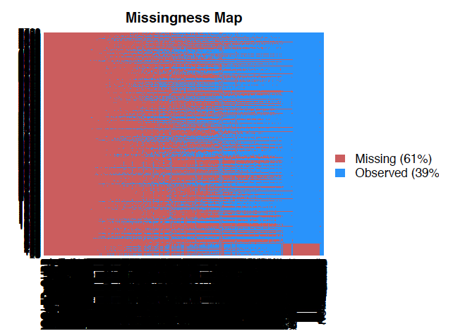

```{r Load libraries, warning=FALSE, message=FALSE, include=FALSE}
library(tidyverse)
if(!require(Amelia)){
    install.packages("Amelia")
}
library(Amelia)
if(!require(corrplot)){
    install.packages("corrplot")
}
library(corrplot)
if(!require(caret)){
    install.packages("caret")
}
library(caret)
if(!require(mice)){
    install.packages("mice")
}
library(mice)
if(!require(missForest)){
    install.packages("missForest")
}
library(missForest)
if(!require(olsrr)){
    install.packages("olsrr")
}
library(olsrr)
if(!require(randomForest)){
    install.packages("randomForest")
}
library(randomForest)
if(!require(ggrepel)){
    install.packages("ggrepel")
}
library(ggrepel)
if(!require(glmnet)){
    install.packages("glmnet")
}
library(glmnet)
```

# Abstract

In this project, we aim to determine which factors have the strongest influence on the earnings of graduates from different institutions of higher education. To do so, we use data from the College Scorecard to predict the earnings of the median graduate from a specific institution 6 years after graduation. On top of personal characteristics such as demographics and family income, we find that institutional characteristics such as ___ may lead to higher incomes post-graduation. To estimate earnings, we used a number of different statistical techniques: (1) an OLS regression, with predictors pulled from the literature; (2) a random forest, with variable importances. Note also that due to the sheer amount of missing data in our dataset, we estimated the relationship between our predictors and earnings both without imputation, which removed many observations, as well as with observations imputed with a random forest technique.  

# Introduction

In the past decade, concern with analyzing and publicizing the employment outcomes of higher educational institutions and career training programs has become increasingly widespread. The release of the College Scorecard dataset by the Obama Administration in 2013 facilitated greater attention to the capacity of incoming undergraduate students to negotiate both the economic cost and prospective pay-off of higher education. In a public announcement, the U.S. Department of Education expressed their concern with enabling students tp make informed and economically sound college decisions, citing the Obama Administration’s commitment to providing “hardworking” students  “a real opportunity to earn an affordable, high quality degree or credential that offers a clear path to economic security and success.” 

## Theories of Inequality

Scholars examining the politics of social inequality have 

Equality of opportunity v. condition

# Data

## Download and clean

To approach this problem, we use data from the College Scorecard, a project of the United States Department of Education. Below, we start by downloading the data. Note that we're starting here with data only from the 2014-15 academic year. 

```{r Data download, message=FALSE, warning=FALSE, cache=TRUE}
college.data <- read.csv("2014_2015_college_data.csv", header = TRUE)
```

This dataset contains 7,703 observations of 1,977 variables. Each observation represents an individual college/university for the 2014-15 school year. 

Now that we have this data, we need to transform it so that R can recognize missing values. Additionally, we (1) drop observations which do not contain our response variable, `MD_EARN_WNE_P6`, which is the "median earnings of students working and not enrolled 6 years after entry," and (2) drop variables for which all observations are N/A.  

```{r Clean the data}
not_all_na <- function(x) any(!is.na(x))
college.data <- college.data %>%
  replace(.=="NULL", NA) %>%
  replace(.== "PrivacySuppressed", NA)

# Drop NAs in response
college.data.section <- college.data %>% 
  drop_na(MD_EARN_WNE_P6) %>%
  select_if(not_all_na)
```

There are a lot of variables to work with in this dataset--too many, in fact. To get around this, we went through our dataset and narrowed down the variables which we have reason to believe could be related to earnings after graduation. These variables range from characteristics of the college, such as the region it is located in or the amount it spends on each student, to characteristics of the student body, such as the share of the graduates who had ever received a Pell Grant. 

Note also that we have limited the scope of our analysis to only four-year colleges (`ICLEVEL == 1`), as it's reasonable to think that the factors that are important for graduates of two-year or more specialized institutions would be different. 

```{r Filter variables}
section1 <- college.data.section %>%
  filter(ICLEVEL == 1) %>%
  select(INSTNM,
         REGION, 
         CONTROL, 
         NUMBRANCH, 
         HIGHDEG, 
         PCIP01:PCIP54, 
         UGDS:PPTUG_EF, 
         PCTPELL, 
         INEXPFTE, 
         TUITFTE, 
         PCTFLOAN, 
         WDRAW_ORIG_YR4_RT, 
         DEBT_MDN, 
         LO_INC_DEBT_MDN:HI_INC_DEBT_MDN,
         PELL_DEBT_MDN:NOTFIRSTGEN_DEBT_MDN, 
         FEMALE, 
         LOAN_EVER:AGE_ENTRY,
         DEPENDENT:FAMINC, -VETERAN, 
         FAMINC,
         MD_EARN_WNE_P6)
```

In this dataframe, unfortunately not all of the variables are classified appropriately (as a float, a factor, etc.). In order to get this data in workable format, we split up the data into the numeric and factor variables, classify each appropriately, and join them together again. 

```{r Numeric classification}
# Select numeric columns
numerics <- section1 %>%
  select(NUMBRANCH:MD_EARN_WNE_P6) %>%
  select(-HIGHDEG)

# Make columns numeric
numerics[,] <- sapply(numerics[,], as.numeric)
```

```{r Categorical classification}
# Select categorical columns
categoricals <- section1 %>%
  select(REGION, 
         CONTROL,
         HIGHDEG)

categoricals <- categoricals %>%
  mutate(REGION = factor(REGION),
         CONTROL = factor(CONTROL),
         HIGHDEG = factor(HIGHDEG))
```

```{r Create final dataset}
# Create final dataframe
df_final <- cbind(INSTNM = as.character(section1$INSTNM),
                  numerics, 
                  categoricals)

df_final <- df_final %>%
  mutate(INSTNM = as.character(INSTNM))
```

## Exploratory data analysis

With the data now in workable format, we can start to take a look at our response and predictors. Our new dataset has 2,822 observations of 77 variables--significantly cut down from our initial one. 

### Response variable

A histogram of our response variable (`MD_EARN_WNE_P6`) is shown below. Note that while this variable is distributed fairly normally, it has a long right tail.  

```{r Histogram of response}
ggplot(data = df_final, aes(df_final$MD_EARN_WNE_P6)) + 
  geom_histogram(binwidth = 10) +
  labs(x = "Median wage", y = "Frequency") +
  theme_minimal()
```

One way to reduce the skew in our dependent would be to take the natural log of it. (This is common practice in Economics for income variables.) When we make a new variable equal to the log of the median wage, its histogram is much more "normal-looking." Moving forward, we use this new response variable as our dependent variable.

```{r Histogram of log median wage}
df_final <- df_final %>%
  mutate(log_md_wage = log(MD_EARN_WNE_P6) + 0.001)

ggplot(data = df_final, aes(df_final$log_md_wage)) + 
  geom_histogram(bins = 40) +
  labs(x = "Log of the median wage", y = "Frequency") +
  theme_minimal()
```

### Pairwise scatterplots

Before we jump in to any modeling, we should understand the relationship our dependent variable has with predictors of interest. Some interesting pairwise scatterplots are displayed below. 

```{r Logwage v faminc, message=FALSE, warning=FALSE}
wage.faminc.plot <- ggplot(df_final, aes(x=FAMINC, y=log_md_wage)) + 
  geom_point(alpha = 0.5) +
  labs(x = "Family income", y = "Log of the median wage") +
  theme_minimal()
wage.faminc.plot
```

The relationship between family income and the log of the median wage seems fairly linear here, necessitating no transformation. 

```{r Logwage v pell, message=FALSE, warning=FALSE}
wage.pell.plot <- ggplot(df_final, aes(x=PELL_EVER, y=log_md_wage)) + 
  geom_point(alpha = 0.5) +
  labs(x = "Number of students who have received a Pell Grant", y = "Log of the median wage") +
  theme_minimal()
wage.pell.plot
```

This, too, seems to be a linear relationship, requiring no transformation. 

One relationship that does require a transformation is that below, of log wage versus the median wage after graduation. Note that there is a seeming discontinuity between this relationship after the median debt exceeds 1000. 

```{r Logwage v median debt, warning = FALSE, message = FALSE}
wage.meddebt.plot <- ggplot(df_final, aes(x=DEBT_MDN, y=log_md_wage)) + 
  geom_point(alpha = 0.2) +
  labs(x = "Median debt", y = "Log of the median wage") +
  theme_minimal()
wage.meddebt.plot
```

```{r Logwage v log median debt, warning = FALSE, message = FALSE}
df_final <- df_final %>%
  mutate(logdebt = log(DEBT_MDN))

wage.logmeddebt.plot <- ggplot(df_final, aes(x=logdebt, y=log_md_wage)) + 
  geom_point(alpha = 0.2) +
  labs(x = "Log of median debt", y = "Log of the median wage") +
  theme_minimal()
wage.logmeddebt.plot
```

While still not perfect, taking the log of the median debt seems to make this relationship a little better. 

### Correlations

We can dive into this data a little more deeply using a correlation matrix. We've made one and plotted it below. 

```{r Correlation matrix}
# Add in new variables into numerics
numerics <- numerics %>%
  mutate(logdebt = log(DEBT_MDN),
         log_md_wage = log(MD_EARN_WNE_P6) + 0.001)

# Correlation matrix
corr_matrix <- cor(numerics, use = "complete.obs")
corrplot(corr_matrix, method="color", tl.cex = 0.4)
```

Much of the space in this matrix is taken up by the `PCIP01`, `PCIP03`, etc. variables. To zoom in on the other variables, we can take these out and re-run our correlation matrix.

```{r Correlation matrix 2, cache=TRUE}
corr_matrix2 <- cor(numerics[,40:ncol(numerics)], use = "complete.obs")
corrplot(corr_matrix2, method="color", tl.cex = 0.5)
```

As we'd expect, many of the debt measures are highly correlated with each other. Additionally, there are very strongly positive and strongly negative correlations in a cluster toward the bottom right of this graph, between variables like `FAMINC`, `FIRST_GEN`, and `AGE_ENTRY`. 

### Missingness

One piece of the pie that proved tricky for us moving forward in our analysis has been the amount of missingness present in the College Scorecard dataset. As shown below, fully 61% of the data in the 2014-2015 College Scorecard file is missing. (Note that we've actually attached a picture instead of the code output--the image generated by the code itself takes around 40 Mb.)

```{r Visualize missingness for full dataset, eval = FALSE}
missmap(college.data)
```



Fortunately for us, after all of our data cleaning, this picture looks much better. In our final dataset (`df_final`), 93% of observations are present. 

One interesting thing to note in this missingness map is the giant block of missing data in the bottom left. This missing data chunk, clearly not missing at random, is comprised mostly of schools such as Keiser University, Harrison College, Rasmussen College, Strayer University. These schools have a couple things in common: for one, all have multiple branches, and perhaps most tellingly, these are not categorized as degree-granting institutions. For these schools, the College Scorecard does not report the shares of degrees awarded in a particular major, the racial makeup of these schools, or how much tuition revenue these schools receive per student.

```{r Visualize missingness for df_final, cache=TRUE}
missmap(df_final)
```

In our scenario, observations are not exactly a precious resource; we could afford to get rid of this chunk of observations. This has some benefits as well. In addition to being theoretically sound (as non-degree granting institutions may play a different role in determining future income than degree-granting institutions), these observations are distinctly not missing at random. This means that any imputation (done later) to determine these values would be fundamentally flawed. 

After ridding the dataset of this chunk of observations, our new missingnessmap looks as follows. Note that fully 98% of our observations are present. Not too bad! 

```{r Visualize missingness without red chunk, cache=TRUE}
df_final_section <- df_final[1:2634,]
missmap(df_final_section)
```

### Principal component analysis 

One last method to examine the structure and content of our data is principal component analysis (PCA). Conducting principle component analysis can be quite useful in order to get a sense of what our data looks like and what different kinds of colleges we're dealing with. After finding the primary axes of variation (principal components), we are able to determine whether there are different "clusters" of colleges: ones that focus more on certain kinds of areas of study, are more or less career focused, etc. 

```{r PCA generation and plot, cache = TRUE}
# Drop odd chunk of obs from numerics dataset
numerics.section <- numerics[1:2634,]
numerics.nona <- drop_na(numerics.section)
df_final_section_nona <- drop_na(df_final_section)

# PCA
set.seed(40)
pca <- prcomp(numerics.nona, scale. = TRUE)
pcs <- as.data.frame(pca$x)
pc1 <- pca$rotation[, 1]
pc2 <- pca$rotation[, 2]
pca3 <- pca$rotation[, 3]
pcs$INSTNM <- df_final_section_nona$INSTNM

# Plot
ggplot(pcs, aes(x = PC1, y = PC2)) +
  geom_point(alpha = .5) +
  theme_minimal()
```

This is a very interesting biplot. Along the first two principal components, there are two clear groups, one of which has a greater PC2 value than the other. Additionally, in the group of observations at the bottom half of the biplot, there appears to be the most density at high values for PC1 and low values for PC2. In the upper group of observations, the most density occurs at low/mid values of PC1 and moderate values of PC2. 

```{r Scree plot}
scree.data <- tibble(PC = 1:75,
                     PVE = pca$sdev^2 /
                       sum(pca$sdev^2))
ggplot(scree.data, aes(x = PC, y = PVE)) +
  geom_line() + 
  geom_point() +
  theme_minimal()
```

As seen in the scree plot above, there is a clear, distinct elbow in our data. The first two principal components explain a little less 30% of the variation in the data, after which each individual principal component becomes increasingly meaningless. 

#### A deeper dive

Clearly, the first and second principal components capture important sources of variation among colleges. However, we don't yet know what they actually are. Taking inspiration from group 9 (Paul Nguyen and David Herrero Quevedo), we dove deeper into which variables are actually important in making up these components. 

As an initial step, it may be illuminating to label a random sample of these observations to see if any obvious patterns pop out. After, we plot the location of traditional groups (e.g. the Ivies) to see if there is any validity to grouping these elite colleges together. 

```{r Sample schools in biplot}
set.seed(532)
random.schools <- sample(pcs$INSTNM, 10)
ivies <- c("Brown University", "Columbia University", "Cornell University", "Dartmouth College", "Harvard University", "University of Pennsylvania", "Princeton University", "Yale University")

# Plot random schools
ggplot(pcs, aes(x = PC1, y = PC2)) +
  geom_point(alpha = .1) +
  geom_text_repel(data = subset(pcs, INSTNM %in% random.schools),
            aes(label = INSTNM)) +
  geom_point(color = "red",
             data = subset(pcs, INSTNM %in% random.schools,
             alpha = .5)) +
  theme_minimal()
```

Unfortunately, it's not immediately obvious through labeling some schools on these principal components what the components actually mean. To try to get more recognizable names, we've labeled the Ivy League.

```{r Ivies in biplot}
ggplot(pcs, aes(x = PC1, y = PC2)) +
  geom_point(alpha = .1) +
  geom_text_repel(data = subset(pcs, INSTNM %in% ivies),
            aes(label = INSTNM)) +
  geom_point(color = "red",
             data = subset(pcs, INSTNM %in% ivies,
             alpha = .5)) +
  theme_minimal()
```

Clearly here, the Ivies (or at least the ones which survived our purge of non-NA data) are all on the left side of the biplot, indicating that the left side of the plot (when PC1 is negative) may be a region with more prestigious, smaller schools. Harvard is a notable outlier from both main groups. 

For sheer curiosity's sake, Reed's location on this biplot is shown below:

```{r Reed in biplot}
ggplot(pcs, aes(x = PC1, y = PC2)) +
  geom_point(alpha = .1) +
  geom_text_repel(data = subset(pcs, INSTNM %in% c("Reed College")),
            aes(label = INSTNM)) +
  geom_point(color = "red",
             data = subset(pcs, INSTNM %in% c("Reed College"),
             alpha = .5)) +
  theme_minimal()
```

Good news for Reed graduates; we're almost in exactly the same spot as most of the Ivies! 

While plotting the locations of any given college on the principal component biplot is fun (and a little informative), it doesn't give us a deep understanding of what these components mean. Moving forward, we took a more statistical approach toward understanding this. 

Below, we've plotted the "rotation" of our first principal component. Essentially, this plot shows how each variable is weighted when making PC1: a strong, positive number indicates that PC1 is strongly associated with a given variable, and vice versa.  

```{r Understanding PC1}
pca_rotations <- data.frame(pca$rotation)
pca_rotations$variables <- rownames(pca_rotations)
pc1.ordered.rotations <- pca_rotations[order(-pca_rotations$PC1),]
pc2.ordered.rotations <- pca_rotations[order(-pca_rotations$PC2),]

ggplot(pca_rotations, 
       aes(x = variables, y = PC1)) +
  geom_col() +
  coord_flip() +
  labs(x = "Variables", y = "First PC") +
  theme(text = element_text(size = 5.5)) 
```

Due to the sheer amount of variables in our PCA, it's hard to read which variables are positively and negatively correlated with the first PC. For the reader's sake, we've also sorted the variables by their impact on PC1. 

As seen below, the 6 variables most associated with PC1 are: 

1. `FIRST_GEN`
2. `AGE_ENTRY`
3. `PELL_EVER`
4. `PCTPELL`
5. `WDRAW_ORIG_YR4_RT`
6. `LO_INC_DEBT_MDN`

The six most negatively associated with PC1 are: 

1. `DEPENDENT`
2. `PCIP26`
3. `PCIP45`
4. `PCIP23`
5. `PCIP54`
6. `FAMINC`

One way of interpreting PC1, then, could be as a measure of the privelege (or lack thereof) of the students. 

```{r PC1 associated variables}
head(pc1.ordered.rotations)[,1:2]
tail(pc1.ordered.rotations)[,1:2]
```

We can do the same thing with the second principal component. 

As seen below, the 6 variables most correlated with PC2 are:

1. `PCIP15`
2. `NUMBRANCH`
3. `PCIP11`
4. `PCTFLOAN`
5. `PCTPELL`
6. `PCIP10`

The six most negatively correlated with PC2 are:

1. `logdebt`
2. `FEMALE_DEBT_MDN`
3. `FIRSTGEN_DEBT_MDN`
4. `PELL_DEBT_MDN`
5. `NOTFIRSTGEN_DEBT_MDN`
6. `DEBT_MDN`

This principal component is a little less intuitive to understand, but clearly relates somewhat to the indebtedness of the student body, in addition to their specific major interests. Higher PC2 values may imply more of a focus on more rewarded majors (such as engineering or computer science).

```{r PC2 associated variables}
head(pc2.ordered.rotations)[,1:2]
tail(pc2.ordered.rotations)[,1:2]
```

## Imputation

As you might note in our exploratory data analysis, there wass quite a bit of missing data in our original dataset. While our final dataset is significantly better, with 98% of observations present, one way to get around this is to impute the missing observations using the other predictors.

We use two different methods to impute missing data: (1) multiple imputation using the `mice` package, which uses predictive mean matching and logistic regression to perform multiple imputation on continuous and categorical data; and (2) imputation using `missForest`, which uses a random forest model to predict each missing observation, no matter the type thereof. Note that both of these techniques assume that the missing data is "missing at random" (MAR). While this is more likely the case after our data cleaning, this is still likely a stretch, so any results generated from the imputed data should be taken with a grain of salt. 

### Imputation with `mice`

In order to impute our missing values using the `mice` package, we need to impute the continuous variables and categorical variables separately. To impute the continuous variables, we will use predictive mean matching. Fortunately for us, there are no missing observations for the categorical variables, so we do not have to impute anything there.

Below we impute the continuous variables. 

```{r Impute continuous variables, message=FALSE, cache=TRUE}
numerics.mice <- mice(numerics.section, m=5, maxit = 30, method = 'pmm', seed = 500)

numerics.mice.df1 <- complete(numerics.mice, 1)
numerics.mice.df2 <- complete(numerics.mice, 2)
numerics.mice.df3 <- complete(numerics.mice, 3)
numerics.mice.df4 <- complete(numerics.mice, 4)
numerics.mice.df5 <- complete(numerics.mice, 5)
```

```{r Combine numerical imputed values into one dataset, cache=TRUE}
# Create empty dataframe
df_numerics.mice <- data.frame(matrix(NA, nrow = 2634, ncol = 75))

# Replace cells with the mean of the 5 imputed dataframes
for (i in 1:2634) {
  for (j in 1:75) {
    df_numerics.mice[i,j] = mean(numerics.mice.df1[i,j],
                                 numerics.mice.df2[i,j],
                                 numerics.mice.df3[i,j],
                                 numerics.mice.df4[i,j],
                                 numerics.mice.df5[i,j])
  }
}

# Rename columns to the correct names
for (i in 1:75){
  names(df_numerics.mice)[i] = names(numerics)[i]
}
```

```{r Create final mice imputed dataset}
df.final.mice <- cbind.data.frame(INSTNM = df_final_section$INSTNM,
                                  df_numerics.mice,
                                  categoricals[1:2634,])

df.final.mice <- df.final.mice %>%
  mutate(INSTNM = as.character(INSTNM))
```

### Multiple imputation with `missForest`

Below, we use the `missForest` package to impute our missing data. Unlike the `mice` package, we can do this imputation in one step, which makes it much more simple. 

```{r Impute variables with missForest, cache=TRUE}
nonchars.section <- cbind(numerics.section,
                          categoricals[1:2634,])
missForest.imputation <- missForest(nonchars.section)
```

```{r missForest dataframe, cache=TRUE}
missForest_df <- cbind.data.frame(INSTNM = df_final_section$INSTNM,
                                  missForest.imputation$ximp)
```

## Modeling

With our data now in workable format, with two different ways of imputing missingness, we now turn to modeling our data. 

### Linear models

Following the literature cited in our introduction, we built a theoretical model on what might impact graduates' earnings. This model is described with the equation below.

$$median \space earnings = \alpha + \beta_1 college \space characteristics + \beta_2 student \space demographics + \epsilon$$

To capture **college characteristics**, we use the following variables:
- percentage of degrees awarded in many different majors (`PCIP01`, `PCIP02`, etc.)
- size of the school (`UGDS`)
- instructional expenditures per student (`INEXPFTE`)
- region of the school (`REGION`)
- share of students that are part-time (`PPTUG_EF`)
- tuition revenue per student (`TUITFTE`)
- ownership of school (`CONTROL`)
- highest degree awarded (`HIGHDEG`)

To capture **student demographics**, we use the following variables from our dataset:
- racial makeup of the school (`UGDS_WHITE`)
- debt after graduation (`DEBT_MDN`)
- gender makeup of school (`FEMALE`)
- age makeup of school (`AGE_ENTRY`)
- share of students that are first-generation (`FIRST_GEN`)
- median family income (`FAMINC`)
- share of students who have received a loan (`LOAN_EVER`)
- share of students who have received a Pell Grant (`PELL_EVER`)

#### Without imputation

Since we essentially have three datasets with these variables, it's an interesting exercise to see how the results of our analysis might differ with and without imputation. To start, we'll run a linear model of the above specification on the dataset without any imputation. 

```{r Linear model without imputation, cache=TRUE}
linear.model.1 <- lm(log_md_wage ~ 
                       PCIP01 +
                       PCIP03 +
                       PCIP04 +
                       PCIP05 +
                       PCIP09 +
                       PCIP10 +
                       PCIP11 +
                       PCIP12 +
                       PCIP13 + 
                       PCIP14 +
                       PCIP15 +
                       PCIP16 +
                       PCIP19 +
                       PCIP22 +
                       PCIP23 +
                       PCIP24 +
                       PCIP25 +
                       PCIP26 +
                       PCIP27 +
                       PCIP29 +
                       PCIP30 +
                       PCIP31 + 
                       PCIP38 +
                       PCIP39 +
                       PCIP40 +
                       PCIP41 +
                       PCIP42 +
                       PCIP43 +
                       PCIP44 +
                       PCIP45 +
                       PCIP46 +
                       PCIP47 +
                       PCIP48 +
                       PCIP49 +
                       PCIP50 +
                       PCIP51 +
                       PCIP52 +
                       PCIP54+
                       UGDS +
                       UGDS_WHITE +
                       INEXPFTE +
                       logdebt +
                       FEMALE +
                       AGE_ENTRY +
                       FIRST_GEN +
                       REGION +
                       PPTUG_EF +
                       TUITFTE + 
                       LOAN_EVER +
                       FAMINC +
                       CONTROL +
                       PELL_EVER +
                       HIGHDEG, 
                     data = df_final_section)
summary(linear.model.1)

#Run model diagnostics
par(mfrow = c(2, 2))
plot(linear.model.1)
```

## Results

  This model had a lot of unsurprising results, such as the importance of degrees in typically high/low-paying careers, but also had some surprises. The variable for expenditure per student, for example, was not significant, and neither was family income. It seems that controlling for other aspects of colleges is enough to render it insignificant.There were only two significant regions, neither of which are New England. 
Linear model (w/ full dataset, no imputation)

  As our diagnostic plots show, the model is quite robust in terms of linearity, normality, and homoskedasticity, although the tails of the distribution are a bit fatter than normal. 

```{r Linear model with mice imputation, cache=TRUE}
linear.model.2 <- lm(log_md_wage ~ 
                       PCIP01 +
                       PCIP03 +
                       PCIP04 +
                       PCIP05 +
                       PCIP09 +
                       PCIP10 +
                       PCIP11 +
                       PCIP12 +
                       PCIP13 + 
                       PCIP14 +
                       PCIP15 +
                       PCIP16 +
                       PCIP19 +
                       PCIP22 +
                       PCIP23 +
                       PCIP24 +
                       PCIP25 +
                       PCIP26 +
                       PCIP27 +
                       PCIP29 +
                       PCIP30 +
                       PCIP31 + 
                       PCIP38 +
                       PCIP39 +
                       PCIP40 +
                       PCIP41 +
                       PCIP42 +
                       PCIP43 +
                       PCIP44 +
                       PCIP45 +
                       PCIP46 +
                       PCIP47 +
                       PCIP48 +
                       PCIP49 +
                       PCIP50 +
                       PCIP51 +
                       PCIP52 +
                       PCIP54+
                       UGDS +
                       UGDS_WHITE +
                       INEXPFTE +
                       logdebt +
                       FEMALE +
                       AGE_ENTRY +
                       FIRST_GEN +
                       REGION +
                       PPTUG_EF +
                       TUITFTE + 
                       LOAN_EVER +
                       FAMINC +
                       CONTROL +
                       PELL_EVER +
                       HIGHDEG, 
                     data = df.final.mice)
summary(linear.model.2)

#Run model diagnostics
par(mfrow = c(2, 2))
plot(linear.model.2)
```

```{r Linear model with missForest imputation, cache=TRUE}
linear.model.3 <- lm(log_md_wage ~ 
                       PCIP01 +
                       PCIP03 +
                       PCIP04 +
                       PCIP05 +
                       PCIP09 +
                       PCIP10 +
                       PCIP11 +
                       PCIP12 +
                       PCIP13 + 
                       PCIP14 +
                       PCIP15 +
                       PCIP16 +
                       PCIP19 +
                       PCIP22 +
                       PCIP23 +
                       PCIP24 +
                       PCIP25 +
                       PCIP26 +
                       PCIP27 +
                       PCIP29 +
                       PCIP30 +
                       PCIP31 + 
                       PCIP38 +
                       PCIP39 +
                       PCIP40 +
                       PCIP41 +
                       PCIP42 +
                       PCIP43 +
                       PCIP44 +
                       PCIP45 +
                       PCIP46 +
                       PCIP47 +
                       PCIP48 +
                       PCIP49 +
                       PCIP50 +
                       PCIP51 +
                       PCIP52 +
                       PCIP54+
                       UGDS +
                       UGDS_WHITE +
                       INEXPFTE +
                       logdebt +
                       FEMALE +
                       AGE_ENTRY +
                       FIRST_GEN +
                       REGION +
                       PPTUG_EF +
                       TUITFTE + 
                       LOAN_EVER +
                       FAMINC +
                       CONTROL +
                       PELL_EVER +
                       HIGHDEG, 
                     data = missForest_df)
summary(linear.model.3)

#Run model diagnostics
par(mfrow = c(2, 2))
plot(linear.model.3)
```

## Imputation Results

  The results after imputation do not differ radically from the non-imputed results. There are a few changes in the significance of different shares of majors, as well as a few changes in the significance of other variables, but the models are conceptually quite consistent. However, an interesting note is that the $R^2$ is lower for the imputed models, despite having more cases.

### Lasso models

To supplement these linear regression models, we ran lasso models on each of these datasets to see if the variables which survived penalization are variables which conform to our theoretical expectations.  

Note that when we do not impute any observations, we must use a subsection of the dataset to run a lasso model--only the observations without N/A values. 

#### Without imputation

```{r Lasso model without imputation, cache=TRUE}
# Data setup
lasso.data <- cbind(numerics.section,
                    categoricals[1:2634,])
lasso.data <- lasso.data %>%
  select(-MD_EARN_WNE_P6)
lasso.data.nona <- drop_na(lasso.data)
X <- model.matrix(log_md_wage ~ ., data = lasso.data.nona)[, -1]
Y <- lasso.data.nona$log_md_wage 
grid <- seq(from = 1e4, to = 1e-2, length.out = 100)

# Cross validation to find optimal penalty term
set.seed(1)
cv.out1 = cv.glmnet(X, Y, alpha = 1)
bestlam1 = cv.out1$lambda.min

#Run lasso and get non-zero coefficients of most important variables
lasso.1 = glmnet(x = X, y = Y, alpha = 1, lambda = grid)
lasso.coef = predict(lasso.1, type = "coefficients", s = bestlam1)[1:nrow(coef(lasso.1)),]
nonzero.lasso.coef <- lasso.coef[lasso.coef != 0]
length(nonzero.lasso.coef)
```

## Results

	The lasso model included many degree variables, some of which were not surprising in that they reflected high-paying and low-paying fields, but what was interesting was that Legal degrees had a negative effect. This makes sense, however, when we consider that this dat is filtered for 4 year degree colleges, and thus legal studies are all pre-law, and so these students probably have some more education to go before they start earning a lot of money. The lasso model also chose interesting demographic variables-- where we chose the share of white students as we beleived white vs. non-white to probablly be the most important distinction in student demographics, but the lasso chose Asian, biracial, and unknown racial shares. 


#### Mice imputation

```{r Lasso model with mice imputation, cache=TRUE}
# Data setup
lasso.mice.data <- df.final.mice %>%
  select(-INSTNM, -MD_EARN_WNE_P6)
lasso.mice.nona <- drop_na(lasso.mice.data)
Xmice <- model.matrix(log_md_wage ~ ., data = lasso.mice.nona)
Ymice <- lasso.mice.nona$log_md_wage 
grid <- seq(from = 1e4, to = 1e-2, length.out = 100)

# Cross validation to find optimal penalty term
set.seed(1)
cv.out.mice = cv.glmnet(Xmice, Ymice, alpha = 1)
bestlam.mice = cv.out.mice$lambda.min

#Run lasso and get non-zero coefficients of most important variables
lasso.2 = glmnet(x = Xmice, y = Ymice, alpha = 1, lambda = grid)
lasso.coef.mice = predict(lasso.2, type = "coefficients", s = bestlam.mice)[1:nrow(coef(lasso.2)),]
nonzero.lasso.mice.coef <- lasso.coef.mice[lasso.coef.mice != 0]
length(nonzero.lasso.mice.coef)
```

## Results

Some interesting differences in this model is the inclusion of more racial demographics, expenditure pers student, as well as CONTROL2, the dummy variable for private nonprofit colleges. This model eliminated the highest degree variable as well.

#### missForest imputation

```{r Lasso model with missForest imputation, cache=TRUE}
# Data setup
lasso.missForest.data <- missForest_df %>%
  select(-INSTNM, -MD_EARN_WNE_P6)
lasso.missForest.nona <- drop_na(lasso.missForest.data)
XmissForest <- model.matrix(log_md_wage ~ ., data = lasso.missForest.nona)
YmissForest <- lasso.missForest.nona$log_md_wage 
grid <- seq(from = 1e4, to = 1e-2, length.out = 100)

# Cross validation to find optimal penalty term
set.seed(1)
cv.out.missForest = cv.glmnet(XmissForest, YmissForest, alpha = 1)
bestlam.missForest = cv.out.missForest$lambda.min

#Run lasso and get non-zero coefficients of most important variables
lasso.3 = glmnet(x = XmissForest, y = YmissForest, alpha = 1, lambda = grid)
lasso.coef.missForest = predict(lasso.3, type = "coefficients", s = bestlam.missForest)[1:nrow(coef(lasso.3)),]
nonzero.lasso.missForest.coef <- lasso.coef.missForest[lasso.coef.missForest != 0]
length(nonzero.lasso.missForest.coef)
```

## Results

	This imputed lasso is similar to the previous one, but it also included average family income, and didn’t eliminate the graduate school dummy variable. 

### Random forest modeling

In order to get a sense of what variables are deemed most important by a more data-oriented approach, we decided to run a random forest on our data set and measure variable importance.

```{r Random Forest with non-imputed data, cache=TRUE}
df_forest <- df_final %>%
  select(-INSTNM, -MD_EARN_WNE_P6) %>%
  drop_na()

set.seed(1)
rf.college = randomForest(log_md_wage  ~., data = df_forest, importance = TRUE)
varImpPlot(rf.college, cex = 0.6)
print(rf.college)
```

```{r Random Forest mice, cache=TRUE}
df.forest.mice <- df.final.mice %>%
  select(-INSTNM, -MD_EARN_WNE_P6)

set.seed(1)
rf.college.mice = randomForest(log_md_wage  ~., data = df.forest.mice, importance = TRUE)
varImpPlot(rf.college.mice, cex = 0.6)
print(rf.college.mice)
```

```{r Random Forest missForest, cache=TRUE}
missForest_df_forest <- missForest_df %>%
  select(-INSTNM, -MD_EARN_WNE_P6)

set.seed(1)
rf.college.missForest = randomForest(log_md_wage  ~., data = missForest_df_forest, importance = TRUE)
varImpPlot(rf.college.missForest, cex = 0.6)
print(rf.college.missForest)
```

### Discussion

Both (1) the demographic makeup of a school’s student body and (2) a school’s institutional characteristics play a major role in determining the future wages of graduates. While the most significant variables varied between models and datasets, across all specifications, the share of the student body receiving a degree in a given major was highly associated with both lower and higher incomes, depending on major. This makes a lot of intuitive sense; we think that a computer programmer will, on average, make more than an english teacher. The cases in this data set are not students, however, but colleges. It is possible also, then, that colleges with certain kinds of degree ratios are better at ensuring higher earnings for their students, but the nature of degrees awarded themselves most likely have an effect on future earnings as well. Both these effects probably have an impact on our results. 
Racial and class demographics also consistently showed up in all of our models as significant. In one way or another, all our models considered both the racial and socio-economic composition of schools as very relevant in relation to future wages. 
An interesting note is that the results of racial variables are counterintuitive—it seems that an increase in the share of white students results in lower wages overall. However, because the cases are schools and not individuals in this data set, this result could make sense. Diversity could impact wages in several positive ways, including increasing the prestige of a school and the practical aspect of a diverse student body making for a better learning environment.
These results are consistent with our expectations, as well as our data analysis. Our PCA revealed that most of the variation between schools in this data set is due to privilege of the students first and then nature of the school itself, and so that this kind of relationship holds with wages as a dependent variable is not too surprising. 
This project does have many weaknesses, however. Many of the variables that we wanted to use, such as average standardized test scores, were unusable due to missing data. There is also much information that our data did not capture, and, realistically, can never truly be captured in one dataset and compared between different schools. Arguably, there is much more to Reed College than the amalgamation of the roughly 80 variables that we used in this project, or even the 2000 variables in our starting data set. Capturing and comparing every important characteristic of a college in such a quantitative way is probably impossible. 
Our models most likely have a decent amount of internal validity, but they definitely do not have much external validity. The financial and cultural aspects of education beyond the United States would cause our models to give inaccurate results-- even our variables accounting for region capture this reality within the United States itself. 
Our results imply that college by itself is not enough to solve the issue of a lack of social mobility in the United States. Colleges do not eliminate the previous characteristics of its student body. However, since we do not have data on earnings of non-college institutions, it’s hard to say what effect college education has on the importance of demographics such as race and gender when compared to the alternative. 
Further topics that could be investigated include investigating other years, datasets, and countries, as well as in-state comparisons in order to get a more homogeneous community of schools. Another kind of analysis that could be done is a more micro-focused project concerning the future wages of individual students within a school, rather than a macro focus on just the characteristics and demographics of schools, which could fail to capture the variation within them. Our analysis could also try to extend to other educational institutions, such as high schools. 


### Sources


