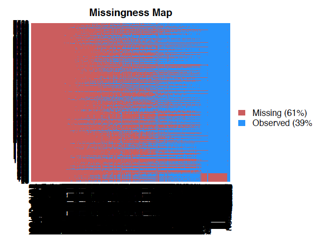

-   [Abstract](#abstract)
-   [Introduction](#introduction)
    -   [Background](#background)
    -   [Research question](#research-question)
    -   [Theories of inequality](#theories-of-inequality)
-   [Data](#data)
    -   [Two cultures](#two-cultures)
    -   [Download and clean](#download-and-clean)
    -   [Exploratory data analysis](#exploratory-data-analysis)
        -   [Response variable](#response-variable)
        -   [Pairwise scatterplots](#pairwise-scatterplots)
        -   [Correlations](#correlations)
        -   [Missingness](#missingness)
        -   [Principal component
            analysis](#principal-component-analysis)
    -   [Imputation](#imputation)
        -   [Imputation with `mice`](#imputation-with-mice)
        -   [Multiple imputation with
            `missForest`](#multiple-imputation-with-missforest)
-   [Modeling](#modeling)
    -   [Linear models](#linear-models)
        -   [Without imputation](#without-imputation)
        -   [With imputation using `mice`](#with-imputation-using-mice)
        -   [With imputation using
            `missForest`](#with-imputation-using-missforest)
        -   [Imputation Results](#imputation-results)
    -   [Lasso models](#lasso-models)
        -   [Without imputation](#without-imputation-1)
        -   [Mice imputation](#mice-imputation)
        -   [missForest imputation](#missforest-imputation)
    -   [Random forest models](#random-forest-models)
        -   [Results](#results-4)
        -   [Imputation Results](#imputation-results-1)
    -   [Analysis of the residuals](#analysis-of-the-residuals)
-   [Discussion](#discussion)
-   [Sources](#sources)

Abstract
========

In this project, we aim to determine which factors have the strongest
influence on the earnings of graduates from different institutions of
higher education. To do so, we use data from the College Scorecard to
predict the earnings of the median graduate from a specific institution
6 years after graduation. On top of personal characteristics such as
demographics, we find that the share of degrees awarded in certain
fields may lead to higher incomes post-graduation. To estimate earnings,
we used a number of different statistical techniques: (1) an OLS
regression, with predictors drawn from the literature; (2) a lasso
regression; (3) a random forest, with variable importances. Note also
that due to the sheer amount of missing data in our dataset, we
estimated the relationship between our predictors and earnings both
without imputation, which removed many observations, as well as with
observations imputed with a random forest technique.

Introduction
============

Background
----------

In the past decade, concern with publicizing the employment outcomes of
higher educational institutions and career training programs has become
increasingly widespread. The release of the College Scorecard dataset by
the Obama Administration in 2013 facilitated greater attention to the
capacity of incoming undergraduate students to negotiate both the
economic cost and prospective pay-off of higher education. In a public
announcement, the U.S. Department of Education expressed their concern
with enabling students to make informed and economically sound college
decisions, citing the Obama Administration’s commitment to providing
students “a real opportunity to earn an affordable, high quality degree
or credential that offers a clear path to economic security and
success.”

Other efforts to collect college earnings data for similar purposes have
been constrained by multiple factors. PayScale is a site that discloses
the self-reported earnings of students by degree and institution,
subsequently relying on data that is biased by voluntary reporting.
Certain states, such as Texas and North Carolina, have used in-state
unemployment insurance records and graduate records to produce
tabulations of graduate earnings data. However, these tabulations only
include in-state students and do not include more mobile students that
may receive higher earnings. Recognizing the limitations of previous
datasets, the Longitudinal Employer-Household Dynamics (LEHD) program
collaborated with universities, the U.S. Census Bureau, and state
agencies to launch an experimental research project in early 2018. Using
institutional transcript data and a national database of jobs, the
program released tabulations of post-graduation earnings by the degree,
the partner institution, and the field of students. However, the dataset
currently represents only a small number of colleges.

As discussed later on below, we confronted our own challenges in our
analysis of the College Scorecard dataset. While we optimized the
usability of our dataset, the accessibility of college earnings data and
institutional features still slightly limited our ability to engage with
our theoretical research question holistically.

Research question
-----------------

We were similarly interested in identifying the factors that are
important to determining the income of graduates from a given college
several years after graduation. While the interconnection between
educational and income inequality is clear, how can we better understand
this mutual impact? While research has shown that receiving a college
education enhances economic mobility, what are the characteristics of
individual institutions that might further enhance or diminish student
income post-graduation? Moreover, to what extent does facilitating equal
opportunity, and the accessibility of higher education, actually address
socioeconomic inequality? In short, to what extent do colleges promote
social mobility, and how can we understand the role of prestige and
privilege?

Theories of inequality
----------------------

Scholars examining the politics of social and economic inequality
advance multiple theoretical frameworks. In social mobility research,
sociologists examine the relationship between the inequality of
opportunity and social mobility. Consequently, certain scholars question
the myth of meritocracy and the capacity of equal opportunity and social
mobility to serve as sustainable solutions to social and economic
stratification. As such, these scholars seek instead to integrate the
consideration of unequal wealth and material conditions.

Exploring the relationship between social origins and social mobility
and income equality, sociologists Richard Breen and Jan Jonsson
accentuate the persistent significance of parental socioeconomic
circumstances in shaping the outcome of the latter. Promoting
“prosperity” over “upward mobility,” Neil Gilbert, a Professor of Social
welfare and Social Service, argues that increases in income equality do
not necessarily address the problem of social and economic inequality in
the United States. Acknowledging that a college education is positively
correlated with higher income, Gilbert promotes the recognition of
“relative mobility.” As such, he argues that the increase in income
enabled by higher education does not necessarily correspond to the equal
distribution of income between graduates of similar fields and
institutions.

While professors of economics Eric Eide and Michael Hilmer argue that
the prestige of an institution increases the earnings of graduates, they
accentuate how the field that graduates choose ultimately plays a much
more significant role in accounting for the variation in earnings
post-graduation. In accordance with these scholars, we were interested
in discovering the extent that social origins and factors beyond
institutional prestige and educational attainment itself shape earnings.

Data
====

The U.S. Department of Education released the first College Scorecard
dataset in 2013 in an effort to facilitate the transparency of
institutional outcomes and features. The dataset is collected through
the consolidation of federal reports from institutions as well as
financial federal aid and IRS tax records. Redesigned in 2015, the data
includes extensive information on the average earnings, debt, and
employment outcomes of student cohorts up to ten years after graduation,
encompassing institutional demographics from the 1997-1997 to 2017-2018
academic year.

In our project, we chose to focalize the dataset that was released at
the 2014-2015 academic year. This dataset provides the most recent and
complete information. Before cleaning, the 2014-2015 dataset contained
1,977 variables and 7,703 observations, and each observation represents
one participating institution. Institutions included both degree and
non-degree graduating institutions. To address our question, we selected
the median earnings of students six years after graduation as our
response variable. In considering the extent of possible outliers, we
chose to utilize median earnings over the mean, and we logged the
response variable to account for the skew.

As discussed further below, the large extent of missingness in our data
limited the usability of all of our variables. During our initial
exploration, narrowed down our dataset to include only four year
institutions and dropped about one hundred of the variables that were
either protected for privacy or did not contain any information. A
majority of our variables contained metrics that measured similar
institutional aspects. Consequently, as such, drawing from our
theoretical approach we further reduced our dataset by eliminating
redundant variables and variables that were apparently irrelevant to our
question.

However, we recognized the potentially consequential impact of the
extent of our data’s missingness on our capacity to draw informed
inferences. As such, discussed further below, we also ran multiple
imputation on the initial large dataset, and implemented all of our
models on the imputed dataset as well. We compared those results to the
results of the models that were implemented on the dataset including
missingness. Recognizing the likeliness that missingness of our dataset
is not at random however, our capacity to make definitive statements
from our models after imputation is still limited.

Two cultures
------------------

The uniqueness of our dataset’s missingness and included metrics motivated us to consider the construction of models that were not entirely guided by our initial theoretical assumptions. Considering the amount of variables that we identified as “redundant,” would an algorithmic be better suited to select representative and important variables? Consequently we were interested in comparing the feature selection that we did on our own in OLS regression with the feature selection resulting from the lasso and random forest model. Drawing from Breiman, our implementation of both algorithmic and data modeling shaped both the different datasets and “important” variables that we identified in each model. We selected the variables in our OLS regression model out of the dataset that we created in our initial selection of relevant variables. In doing so, we focalized features of individual institutions and student populations, including prevalent majors and racial, gender, and socioeconomic demographics. However, the nature of our lasso regression and random forest model required us to drop any variables with missingness from our dataset. 

Download and clean
------------------

To approach this problem, we use data from the College Scorecard, a
project of the United States Department of Education. Below, we start by
downloading the data. Note that we're starting here with data only from
the 2014-15 academic year.

    college.data <- read.csv("2014_2015_college_data.csv", header = TRUE)

This dataset contains 7,703 observations of 1,977 variables. Each
observation represents an individual college/university for the 2014-15
school year.

Now that we have this data, we need to transform it so that R can
recognize missing values. Additionally, we (1) drop observations which
do not contain our response variable, `MD_EARN_WNE_P6`, which is the
"median earnings of students working and not enrolled 6 years after
entry," and (2) drop variables for which all observations are N/A.

    not_all_na <- function(x) any(!is.na(x))
    college.data <- college.data %>%
      replace(.=="NULL", NA) %>%
      replace(.== "PrivacySuppressed", NA)

    # Drop NAs in response
    college.data.section <- college.data %>% 
      drop_na(MD_EARN_WNE_P6) %>%
      select_if(not_all_na)

There are a lot of variables to work with in this dataset--too many, in
fact. To get around this, we went through our dataset and narrowed down
the variables which we have reason to believe could be related to
earnings after graduation. These variables range from characteristics of
the college, such as the region it is located in or the amount it spends
on each student, to characteristics of the student body, such as the
share of the graduates who had ever received a Pell Grant.

Note also that we have limited the scope of our analysis to only
four-year colleges (`ICLEVEL == 1`), as it's reasonable to think that
the factors that are important for graduates of two-year or more
specialized institutions would be different.

    section1 <- college.data.section %>%
      filter(ICLEVEL == 1) %>%
      select(INSTNM,
             REGION, 
             CONTROL, 
             NUMBRANCH, 
             HIGHDEG, 
             PCIP01:PCIP54, 
             UGDS:PPTUG_EF, 
             PCTPELL, 
             INEXPFTE, 
             TUITFTE, 
             PCTFLOAN, 
             WDRAW_ORIG_YR4_RT, 
             DEBT_MDN, 
             LO_INC_DEBT_MDN:HI_INC_DEBT_MDN,
             PELL_DEBT_MDN:NOTFIRSTGEN_DEBT_MDN, 
             FEMALE, 
             LOAN_EVER:AGE_ENTRY,
             DEPENDENT:FAMINC, -VETERAN, 
             FAMINC,
             MD_EARN_WNE_P6)

In this dataframe, unfortunately not all of the variables are classified
appropriately (as a float, a factor, etc.). In order to get this data in
workable format, we split up the data into the numeric and factor
variables, classify each appropriately, and join them together again.

    # Select numeric columns
    numerics <- section1 %>%
      select(NUMBRANCH:MD_EARN_WNE_P6) %>%
      select(-HIGHDEG)

    # Make columns numeric
    numerics[,] <- sapply(numerics[,], as.numeric)

    # Select categorical columns
    categoricals <- section1 %>%
      select(REGION, 
             CONTROL,
             HIGHDEG)

    categoricals <- categoricals %>%
      mutate(REGION = factor(REGION),
             CONTROL = factor(CONTROL),
             HIGHDEG = factor(HIGHDEG))

    # Create final dataframe
    df_final <- cbind(INSTNM = as.character(section1$INSTNM),
                      numerics, 
                      categoricals)

    df_final <- df_final %>%
      mutate(INSTNM = as.character(INSTNM))

Exploratory data analysis
-------------------------

With the data now in workable format, we can start to take a look at our
response and predictors. Our new dataset has 2,822 observations of 77
variables--significantly cut down from our initial one.

### Response variable

A histogram of our response variable (`MD_EARN_WNE_P6`) is shown below.
Note that while this variable is distributed fairly normally, it has a
long right tail.

    ggplot(data = df_final, aes(df_final$MD_EARN_WNE_P6)) + 
      geom_histogram(binwidth = 10) +
      labs(x = "Median wage", y = "Frequency") +
      theme_minimal()

One way to reduce the skew in our dependent would be to take the natural
log of it. (This is common practice in Economics for income variables.)
When we make a new variable equal to the log of the median wage, its
histogram is much more "normal-looking." Moving forward, we use this new
response variable as our dependent variable.

    df_final <- df_final %>%
      mutate(log_md_wage = log(MD_EARN_WNE_P6) + 0.001)

    ggplot(data = df_final, aes(df_final$log_md_wage)) + 
      geom_histogram(bins = 40) +
      labs(x = "Log of the median wage", y = "Frequency") +
      theme_minimal()

### Pairwise scatterplots

Before we jump in to any modeling, we should understand the relationship
our dependent variable has with predictors of interest. Some interesting
pairwise scatterplots are displayed below.

    wage.faminc.plot <- ggplot(df_final, aes(x=FAMINC, y=log_md_wage)) + 
      geom_point(alpha = 0.5) +
      labs(x = "Family income", y = "Log of the median wage") +
      theme_minimal()
    wage.faminc.plot

The relationship between family income and the log of the median wage
seems fairly linear here, necessitating no transformation.

    wage.pell.plot <- ggplot(df_final, aes(x=PELL_EVER, y=log_md_wage)) + 
      geom_point(alpha = 0.5) +
      labs(x = "Number of students who have received a Pell Grant", y = "Log of the median wage") +
      theme_minimal()
    wage.pell.plot

This, too, seems to be a linear relationship, requiring no
transformation.

One relationship that does require a transformation is that below, of
log wage versus the median wage after graduation. Note that there is a
seeming discontinuity between this relationship after the median debt
exceeds 1000.

    wage.meddebt.plot <- ggplot(df_final, aes(x=DEBT_MDN, y=log_md_wage)) + 
      geom_point(alpha = 0.2) +
      labs(x = "Median debt", y = "Log of the median wage") +
      theme_minimal()
    wage.meddebt.plot

    df_final <- df_final %>%
      mutate(logdebt = log(DEBT_MDN))

    wage.logmeddebt.plot <- ggplot(df_final, aes(x=logdebt, y=log_md_wage)) + 
      geom_point(alpha = 0.2) +
      labs(x = "Log of median debt", y = "Log of the median wage") +
      theme_minimal()
    wage.logmeddebt.plot

While still not perfect, taking the log of the median debt seems to make
this relationship a little better.

### Correlations

We can dive into this data a little more deeply using a correlation
matrix. We've made one and plotted it below.

    # Add in new variables into numerics
    numerics <- numerics %>%
      mutate(logdebt = log(DEBT_MDN),
             log_md_wage = log(MD_EARN_WNE_P6) + 0.001)

    # Correlation matrix
    corr_matrix <- cor(numerics, use = "complete.obs")
    corrplot(corr_matrix, method="color", tl.cex = 0.4)

Much of the space in this matrix is taken up by the `PCIP01`, `PCIP03`,
etc. variables. To zoom in on the other variables, we can take these out
and re-run our correlation matrix.

    corr_matrix2 <- cor(numerics[,40:ncol(numerics)], use = "complete.obs")
    corrplot(corr_matrix2, method="color", tl.cex = 0.5)

As we'd expect, many of the debt measures are highly correlated with
each other. Additionally, there are very strongly positive and strongly
negative correlations in a cluster toward the bottom right of this
graph, between variables like `FAMINC`, `FIRST_GEN`, and `AGE_ENTRY`.

### Missingness

One piece of the pie that proved tricky for us moving forward in our
analysis has been the amount of missingness present in the College
Scorecard dataset. As shown below, fully 61% of the data in the
2014-2015 College Scorecard file is missing. (Note that we've actually
attached a picture instead of the code output--the image generated by
the code itself takes around 40 Mb.)

    missmap(college.data)

Fortunately for us, after all of our data cleaning, this picture looks
much better. In our final dataset (`df_final`), 93% of observations are
present.

One interesting thing to note in this missingness map is the giant block
of missing data in the bottom left. This missing data chunk, clearly not
missing at random, is comprised mostly of schools such as Keiser
University, Harrison College, Rasmussen College, Strayer University.
These schools have a couple things in common: for one, all have multiple
branches, and perhaps most tellingly, these are not categorized as
degree-granting institutions. For these schools, the College Scorecard
does not report the shares of degrees awarded in a particular major, the
racial makeup of these schools, or how much tuition revenue these
schools receive per student.

    missmap(df_final)

In our scenario, observations are not exactly a precious resource; we
could afford to get rid of this chunk of observations. This has some
benefits as well. In addition to being theoretically sound (as
non-degree granting institutions may play a different role in
determining future income than degree-granting institutions), these
observations are distinctly not missing at random. This means that any
imputation (done later) to determine these values would be fundamentally
flawed.

After ridding the dataset of this chunk of observations, our new
missingnessmap looks as follows. Note that fully 98% of our observations
are present. Not too bad!

    df_final_section <- df_final[1:2634,]
    missmap(df_final_section)

### Principal component analysis

One last method to examine the structure and content of our data is
principal component analysis (PCA). Conducting principle component
analysis can be quite useful in order to get a sense of what our data
looks like and what different kinds of colleges we're dealing with.
After finding the primary axes of variation (principal components), we
are able to determine whether there are different "clusters" of
colleges: ones that focus more on certain kinds of areas of study, are
more or less career focused, etc.

    # Drop odd chunk of obs from numerics dataset
    numerics.section <- numerics[1:2634,]
    numerics.nona <- drop_na(numerics.section)
    df_final_section_nona <- drop_na(df_final_section)

    # PCA
    set.seed(40)
    pca <- prcomp(numerics.nona, scale. = TRUE)
    pcs <- as.data.frame(pca$x)
    pc1 <- pca$rotation[, 1]
    pc2 <- pca$rotation[, 2]
    pca3 <- pca$rotation[, 3]
    pcs$INSTNM <- df_final_section_nona$INSTNM

    # Plot
    ggplot(pcs, aes(x = PC1, y = PC2)) +
      geom_point(alpha = .5) +
      theme_minimal()

This is a very interesting biplot. Along the first two principal
components, there are two clear groups, one of which has a greater PC2
value than the other. Additionally, in the group of observations at the
bottom half of the biplot, there appears to be the most density at high
values for PC1 and low values for PC2. In the upper group of
observations, the most density occurs at low/mid values of PC1 and
moderate values of PC2.

    scree.data <- tibble(PC = 1:75,
                         PVE = pca$sdev^2 /
                           sum(pca$sdev^2))
    ggplot(scree.data, aes(x = PC, y = PVE)) +
      geom_line() + 
      geom_point() +
      theme_minimal()

As seen in the scree plot above, there is a clear, distinct elbow in our
data. The first two principal components explain a little less 30% of
the variation in the data, after which each individual principal
component becomes increasingly meaningless.

#### A deeper dive

Clearly, the first and second principal components capture important
sources of variation among colleges. However, we don't yet know what
they actually are. Taking inspiration from group 9 (Paul Nguyen and
David Herrero Quevedo), we dove deeper into which variables are actually
important in making up these components.

As an initial step, it may be illuminating to label a random sample of
these observations to see if any obvious patterns pop out. After, we
plot the location of traditional groups (e.g. the Ivies) to see if there
is any validity to grouping these elite colleges together.

    set.seed(532)
    random.schools <- sample(pcs$INSTNM, 10)
    ivies <- c("Brown University", "Columbia University", "Cornell University", "Dartmouth College", "Harvard University", "University of Pennsylvania", "Princeton University", "Yale University")

    # Plot random schools
    ggplot(pcs, aes(x = PC1, y = PC2)) +
      geom_point(alpha = .1) +
      geom_text_repel(data = subset(pcs, INSTNM %in% random.schools),
                aes(label = INSTNM)) +
      geom_point(color = "red",
                 data = subset(pcs, INSTNM %in% random.schools,
                 alpha = .5)) +
      theme_minimal()

Unfortunately, it's not immediately obvious through labeling some
schools on these principal components what the components actually mean.
To try to get more recognizable names, we've labeled the Ivy League.

    ggplot(pcs, aes(x = PC1, y = PC2)) +
      geom_point(alpha = .1) +
      geom_text_repel(data = subset(pcs, INSTNM %in% ivies),
                aes(label = INSTNM)) +
      geom_point(color = "red",
                 data = subset(pcs, INSTNM %in% ivies,
                 alpha = .5)) +
      theme_minimal()

Clearly here, the Ivies (or at least the ones which survived our purge
of non-NA data) are all on the left side of the biplot, indicating that
the left side of the plot (when PC1 is negative) may be a region with
more prestigious, smaller schools. Harvard is a notable outlier from
both main groups.

For sheer curiosity's sake, Reed's location on this biplot is shown
below:

    ggplot(pcs, aes(x = PC1, y = PC2)) +
      geom_point(alpha = .1) +
      geom_text_repel(data = subset(pcs, INSTNM %in% c("Reed College")),
                aes(label = INSTNM)) +
      geom_point(color = "red",
                 data = subset(pcs, INSTNM %in% c("Reed College"),
                 alpha = .5)) +
      theme_minimal()

Good news for Reed graduates; we're almost in exactly the same spot as
most of the Ivies!

While plotting the locations of any given college on the principal
component biplot is fun (and a little informative), it doesn't give us a
deep understanding of what these components mean. Moving forward, we
took a more statistical approach toward understanding this.

Below, we've plotted the "rotation" of our first principal component.
Essentially, this plot shows how each variable is weighted when making
PC1: a strong, positive number indicates that PC1 is strongly associated
with a given variable, and vice versa.

    pca_rotations <- data.frame(pca$rotation)
    pca_rotations$variables <- rownames(pca_rotations)
    pc1.ordered.rotations <- pca_rotations[order(-pca_rotations$PC1),]
    pc2.ordered.rotations <- pca_rotations[order(-pca_rotations$PC2),]

    ggplot(pca_rotations, 
           aes(x = variables, y = PC1)) +
      geom_col() +
      coord_flip() +
      labs(x = "Variables", y = "First PC") +
      theme(text = element_text(size = 5.5)) 

Due to the sheer amount of variables in our PCA, it's hard to read which
variables are positively and negatively correlated with the first PC.
For the reader's sake, we've also sorted the variables by their impact
on PC1.

As seen below, the 6 variables most associated with PC1 are:

1.  `FIRST_GEN`
2.  `AGE_ENTRY`
3.  `PELL_EVER`
4.  `PCTPELL`
5.  `WDRAW_ORIG_YR4_RT`
6.  `LO_INC_DEBT_MDN`

The six most negatively associated with PC1 are:

1.  `DEPENDENT`
2.  `PCIP26`
3.  `PCIP45`
4.  `PCIP23`
5.  `PCIP54`
6.  `FAMINC`

One way of interpreting PC1, then, could be as a measure of the
privelege (or lack thereof) of the students.

    head(pc1.ordered.rotations)[,1:2]

    ##                         PC1         PC2
    ## FIRST_GEN         0.2230471  0.01276022
    ## AGE_ENTRY         0.2198535  0.04969136
    ## PELL_EVER         0.2193488  0.00783683
    ## PCTPELL           0.2059191  0.08313005
    ## WDRAW_ORIG_YR4_RT 0.1959303  0.04487854
    ## LO_INC_DEBT_MDN   0.1468980 -0.11358878

    tail(pc1.ordered.rotations)[,1:2]

    ##                  PC1         PC2
    ## FAMINC    -0.1757293  0.02755402
    ## PCIP54    -0.1863051 -0.05755756
    ## PCIP23    -0.1936778 -0.05809287
    ## PCIP45    -0.1938171 -0.05610580
    ## PCIP26    -0.1967149 -0.06945384
    ## DEPENDENT -0.2249687 -0.04369329

We can do the same thing with the second principal component.

As seen below, the 6 variables most correlated with PC2 are:

1.  `PCIP15`
2.  `NUMBRANCH`
3.  `PCIP11`
4.  `PCTFLOAN`
5.  `PCTPELL`
6.  `PCIP10`

The six most negatively correlated with PC2 are:

1.  `logdebt`
2.  `FEMALE_DEBT_MDN`
3.  `FIRSTGEN_DEBT_MDN`
4.  `PELL_DEBT_MDN`
5.  `NOTFIRSTGEN_DEBT_MDN`
6.  `DEBT_MDN`

This principal component is a little less intuitive to understand, but
clearly relates somewhat to the indebtedness of the student body, in
addition to their specific major interests. Higher PC2 values may imply
more of a focus on more rewarded majors (such as engineering or computer
science).

    head(pc2.ordered.rotations)[,1:2]

    ##                  PC1        PC2
    ## PCIP15    0.07156320 0.16870378
    ## NUMBRANCH 0.11458070 0.16679234
    ## PCIP11    0.10698231 0.12900916
    ## PCTFLOAN  0.09856918 0.11946093
    ## PCTPELL   0.20591914 0.08313005
    ## PCIP10    0.02538417 0.05119268

    tail(pc2.ordered.rotations)[,1:2]

    ##                             PC1        PC2
    ## logdebt              0.05305026 -0.3111716
    ## FEMALE_DEBT_MDN      0.07680293 -0.3128787
    ## FIRSTGEN_DEBT_MDN    0.09731630 -0.3145954
    ## PELL_DEBT_MDN        0.08645264 -0.3245655
    ## NOTFIRSTGEN_DEBT_MDN 0.10304945 -0.3275289
    ## DEBT_MDN             0.10514484 -0.3381817

Imputation
----------

As you might note in our exploratory data analysis, there wass quite a
bit of missing data in our original dataset. While our final dataset is
significantly better, with 98% of observations present, one way to get
around this is to impute the missing observations using the other
predictors.

We use two different methods to impute missing data: (1) multiple
imputation using the `mice` package, which uses predictive mean matching
and logistic regression to perform multiple imputation on continuous and
categorical data; and (2) imputation using `missForest`, which uses a
random forest model to predict each missing observation, no matter the
type thereof. Note that both of these techniques assume that the missing
data is "missing at random" (MAR). While this is more likely the case
after our data cleaning, this is still likely a stretch, so any results
generated from the imputed data should be taken with a grain of salt.

### Imputation with `mice`

In order to impute our missing values using the `mice` package, we need
to impute the continuous variables and categorical variables separately.
To impute the continuous variables, we will use predictive mean
matching. Fortunately for us, there are no missing observations for the
categorical variables, so we do not have to impute anything there.

Below we impute the continuous variables.

    numerics.mice <- mice(numerics.section, m=5, maxit = 30, method = 'pmm', seed = 500)

    numerics.mice.df1 <- complete(numerics.mice, 1)
    numerics.mice.df2 <- complete(numerics.mice, 2)
    numerics.mice.df3 <- complete(numerics.mice, 3)
    numerics.mice.df4 <- complete(numerics.mice, 4)
    numerics.mice.df5 <- complete(numerics.mice, 5)

    # Create empty dataframe
    df_numerics.mice <- data.frame(matrix(NA, nrow = 2634, ncol = 75))

    # Replace cells with the mean of the 5 imputed dataframes
    for (i in 1:2634) {
      for (j in 1:75) {
        df_numerics.mice[i,j] = mean(numerics.mice.df1[i,j],
                                     numerics.mice.df2[i,j],
                                     numerics.mice.df3[i,j],
                                     numerics.mice.df4[i,j],
                                     numerics.mice.df5[i,j])
      }
    }

    # Rename columns to the correct names
    for (i in 1:75){
      names(df_numerics.mice)[i] = names(numerics)[i]
    }

    df.final.mice <- cbind.data.frame(INSTNM = df_final_section$INSTNM,
                                      df_numerics.mice,
                                      categoricals[1:2634,])

    df.final.mice <- df.final.mice %>%
      mutate(INSTNM = as.character(INSTNM))

### Multiple imputation with `missForest`

Below, we use the `missForest` package to impute our missing data.
Unlike the `mice` package, we can do this imputation in one step, which
makes it much more simple.

    nonchars.section <- cbind(numerics.section,
                              categoricals[1:2634,])
    missForest.imputation <- missForest(nonchars.section)

    ##   missForest iteration 1 in progress...done!
    ##   missForest iteration 2 in progress...done!
    ##   missForest iteration 3 in progress...done!
    ##   missForest iteration 4 in progress...done!
    ##   missForest iteration 5 in progress...done!
    ##   missForest iteration 6 in progress...done!
    ##   missForest iteration 7 in progress...done!

    missForest_df <- cbind.data.frame(INSTNM = df_final_section$INSTNM,
                                      missForest.imputation$ximp)

Modeling
========

With our data now in workable format, with two different ways of
imputing missingness, we now turn to modeling our data.

Linear models
-------------

Following the literature cited in our introduction, we built a
theoretical model on what might impact graduates' earnings. This model
is described with the equation below.

$$median \\space earnings = \\alpha + \\beta\_1 college \\space characteristics + \\beta\_2 student \\space demographics + \\epsilon$$

To capture **college characteristics**, we use the following variables:

-   percentage of degrees awarded in many different majors (`PCIP01`,
    `PCIP02`, etc.)

-   size of the school (`UGDS`)

-   instructional expenditures per student (`INEXPFTE`)

-   region of the school (`REGION`)

-   share of students that are part-time (`PPTUG_EF`)

-   tuition revenue per student (`TUITFTE`)

-   ownership of school (`CONTROL`)

-   highest degree awarded (`HIGHDEG`)

To capture **student demographics**, we use the following variables from
our dataset:

-   racial makeup of the school (`UGDS_WHITE`)

-   debt after graduation (`DEBT_MDN`)

-   gender makeup of school (`FEMALE`)

-   age makeup of school (`AGE_ENTRY`)

-   share of students that are first-generation (`FIRST_GEN`)

-   median family income (`FAMINC`)

-   share of students who have received a loan (`LOAN_EVER`)

-   share of students who have received a Pell Grant (`PELL_EVER`)

### Without imputation

Since we essentially have three datasets with these variables, it's an
interesting exercise to see how the results of our analysis might differ
with and without imputation. To start, we'll run a linear model of the
above specification on the dataset without any imputation.

    linear.model.1 <- lm(log_md_wage ~ 
                           PCIP01 +
                           PCIP03 +
                           PCIP04 +
                           PCIP05 +
                           PCIP09 +
                           PCIP10 +
                           PCIP11 +
                           PCIP12 +
                           PCIP13 + 
                           PCIP14 +
                           PCIP15 +
                           PCIP16 +
                           PCIP19 +
                           PCIP22 +
                           PCIP23 +
                           PCIP24 +
                           PCIP25 +
                           PCIP26 +
                           PCIP27 +
                           PCIP29 +
                           PCIP30 +
                           PCIP31 + 
                           PCIP38 +
                           PCIP39 +
                           PCIP40 +
                           PCIP41 +
                           PCIP42 +
                           PCIP43 +
                           PCIP44 +
                           PCIP45 +
                           PCIP46 +
                           PCIP47 +
                           PCIP48 +
                           PCIP49 +
                           PCIP50 +
                           PCIP51 +
                           PCIP52 +
                           PCIP54+
                           UGDS +
                           UGDS_WHITE +
                           INEXPFTE +
                           logdebt +
                           FEMALE +
                           AGE_ENTRY +
                           FIRST_GEN +
                           REGION +
                           PPTUG_EF +
                           TUITFTE + 
                           LOAN_EVER +
                           FAMINC +
                           CONTROL +
                           PELL_EVER +
                           HIGHDEG, 
                         data = df_final_section)
    summary(linear.model.1)

    ## 
    ## Call:
    ## lm(formula = log_md_wage ~ PCIP01 + PCIP03 + PCIP04 + PCIP05 + 
    ##     PCIP09 + PCIP10 + PCIP11 + PCIP12 + PCIP13 + PCIP14 + PCIP15 + 
    ##     PCIP16 + PCIP19 + PCIP22 + PCIP23 + PCIP24 + PCIP25 + PCIP26 + 
    ##     PCIP27 + PCIP29 + PCIP30 + PCIP31 + PCIP38 + PCIP39 + PCIP40 + 
    ##     PCIP41 + PCIP42 + PCIP43 + PCIP44 + PCIP45 + PCIP46 + PCIP47 + 
    ##     PCIP48 + PCIP49 + PCIP50 + PCIP51 + PCIP52 + PCIP54 + UGDS + 
    ##     UGDS_WHITE + INEXPFTE + logdebt + FEMALE + AGE_ENTRY + FIRST_GEN + 
    ##     REGION + PPTUG_EF + TUITFTE + LOAN_EVER + FAMINC + CONTROL + 
    ##     PELL_EVER + HIGHDEG, data = df_final_section)
    ## 
    ## Residuals:
    ##     Min      1Q  Median      3Q     Max 
    ## -5.9472 -0.1018  0.0078  0.1161  1.2699 
    ## 
    ## Coefficients:
    ##               Estimate Std. Error t value Pr(>|t|)    
    ## (Intercept)  6.119e+00  1.212e-01  50.497  < 2e-16 ***
    ## PCIP01      -1.138e-04  8.446e-05  -1.347 0.178105    
    ## PCIP03      -3.000e-04  7.413e-05  -4.046 5.37e-05 ***
    ## PCIP04       3.843e-04  1.936e-04   1.985 0.047261 *  
    ## PCIP05       1.688e-04  1.590e-04   1.062 0.288458    
    ## PCIP09       4.957e-05  2.710e-05   1.829 0.067518 .  
    ## PCIP10      -2.172e-05  8.842e-05  -0.246 0.805971    
    ## PCIP11       8.462e-05  2.150e-05   3.936 8.53e-05 ***
    ## PCIP12      -5.913e-05  4.482e-05  -1.319 0.187291    
    ## PCIP13      -6.878e-05  1.823e-05  -3.774 0.000165 ***
    ## PCIP14       3.094e-04  4.726e-05   6.547 7.23e-11 ***
    ## PCIP15       1.176e-04  2.931e-05   4.011 6.23e-05 ***
    ## PCIP16       6.071e-05  9.395e-05   0.646 0.518244    
    ## PCIP19      -9.318e-05  4.292e-05  -2.171 0.030028 *  
    ## PCIP22      -1.623e-04  5.251e-05  -3.091 0.002016 ** 
    ## PCIP23      -7.243e-05  5.129e-05  -1.412 0.158040    
    ## PCIP24      -1.418e-05  2.008e-05  -0.706 0.480333    
    ## PCIP25      -2.053e-03  2.797e-03  -0.734 0.463103    
    ## PCIP26       5.294e-05  3.237e-05   1.636 0.102037    
    ## PCIP27       1.086e-04  9.029e-05   1.203 0.229215    
    ## PCIP29       6.544e-03  6.767e-03   0.967 0.333686    
    ## PCIP30      -1.459e-05  3.262e-05  -0.447 0.654671    
    ## PCIP31      -5.466e-05  3.057e-05  -1.788 0.073917 .  
    ## PCIP38      -8.022e-05  1.002e-04  -0.801 0.423377    
    ## PCIP39      -4.084e-04  1.178e-04  -3.467 0.000536 ***
    ## PCIP40       6.622e-05  6.655e-05   0.995 0.319796    
    ## PCIP41       5.798e-04  5.583e-04   1.039 0.299080    
    ## PCIP42       2.116e-05  2.318e-05   0.913 0.361464    
    ## PCIP43      -4.023e-06  1.582e-05  -0.254 0.799264    
    ## PCIP44      -6.749e-06  3.265e-05  -0.207 0.836267    
    ## PCIP45       5.449e-05  3.279e-05   1.661 0.096758 .  
    ## PCIP46      -2.583e-04  1.670e-04  -1.547 0.122080    
    ## PCIP47       9.950e-05  7.933e-05   1.254 0.209868    
    ## PCIP48      -2.831e-04  1.407e-04  -2.013 0.044231 *  
    ## PCIP49       4.888e-05  1.667e-04   0.293 0.769443    
    ## PCIP50      -1.341e-04  2.180e-05  -6.151 9.05e-10 ***
    ## PCIP51      -1.325e-05  9.181e-06  -1.443 0.149022    
    ## PCIP52       1.347e-05  9.287e-06   1.450 0.147152    
    ## PCIP54       6.937e-05  7.104e-05   0.976 0.328977    
    ## UGDS        -7.054e-06  5.972e-06  -1.181 0.237663    
    ## UGDS_WHITE  -3.347e-05  6.520e-06  -5.133 3.09e-07 ***
    ## INEXPFTE     5.968e-07  3.209e-06   0.186 0.852475    
    ## logdebt      1.365e-03  5.611e-03   0.243 0.807839    
    ## FEMALE      -9.655e-06  7.236e-06  -1.334 0.182238    
    ## AGE_ENTRY    5.413e-05  6.664e-06   8.123 7.34e-16 ***
    ## FIRST_GEN    3.281e-05  1.217e-05   2.695 0.007087 ** 
    ## REGION2      7.218e-03  2.367e-02   0.305 0.760423    
    ## REGION3     -2.198e-02  2.428e-02  -0.905 0.365401    
    ## REGION4      4.641e-03  2.661e-02   0.174 0.861588    
    ## REGION5     -6.596e-02  2.377e-02  -2.774 0.005577 ** 
    ## REGION6      3.129e-02  2.800e-02   1.117 0.264011    
    ## REGION7     -1.545e-02  3.335e-02  -0.463 0.643181    
    ## REGION8      3.167e-02  2.608e-02   1.214 0.224759    
    ## REGION9     -7.098e-01  5.311e-02 -13.365  < 2e-16 ***
    ## PPTUG_EF     2.738e-05  7.003e-06   3.910 9.48e-05 ***
    ## TUITFTE     -6.860e-06  3.113e-06  -2.204 0.027635 *  
    ## LOAN_EVER   -5.470e-05  8.614e-06  -6.350 2.58e-10 ***
    ## FAMINC      -2.640e-06  4.756e-06  -0.555 0.578870    
    ## CONTROL2    -6.357e-03  1.719e-02  -0.370 0.711525    
    ## CONTROL3    -2.963e-02  2.600e-02  -1.140 0.254490    
    ## PELL_EVER   -3.553e-04  1.276e-05 -27.847  < 2e-16 ***
    ## HIGHDEG1    -1.733e-01  1.939e-01  -0.894 0.371557    
    ## HIGHDEG2    -1.544e-01  1.024e-01  -1.507 0.131837    
    ## HIGHDEG3    -1.138e-01  9.983e-02  -1.140 0.254519    
    ## HIGHDEG4    -7.889e-02  9.997e-02  -0.789 0.430128    
    ## ---
    ## Signif. codes:  0 '***' 0.001 '**' 0.01 '*' 0.05 '.' 0.1 ' ' 1
    ## 
    ## Residual standard error: 0.235 on 2304 degrees of freedom
    ##   (265 observations deleted due to missingness)
    ## Multiple R-squared:  0.679,  Adjusted R-squared:  0.6701 
    ## F-statistic: 76.15 on 64 and 2304 DF,  p-value: < 2.2e-16

    #Run model diagnostics
    par(mfrow = c(2, 2))
    plot(linear.model.1)

#### Results

This model had a lot of unsurprising results, such as the importance of
degrees in typically high/low-paying careers, but also had some
surprises. The variable for expenditure per student, for example, was
not significant, and neither was family income. It seems that
controlling for other aspects of colleges is enough to render it
insignificant.There were only two significant regions, neither of which
are New England.

As our diagnostic plots show, the model is quite robust in terms of
linearity, normality, and homoskedasticity, although the tails of the
distribution are a bit fatter than normal.

### With imputation using `mice`

    linear.model.2 <- lm(log_md_wage ~ 
                           PCIP01 +
                           PCIP03 +
                           PCIP04 +
                           PCIP05 +
                           PCIP09 +
                           PCIP10 +
                           PCIP11 +
                           PCIP12 +
                           PCIP13 + 
                           PCIP14 +
                           PCIP15 +
                           PCIP16 +
                           PCIP19 +
                           PCIP22 +
                           PCIP23 +
                           PCIP24 +
                           PCIP25 +
                           PCIP26 +
                           PCIP27 +
                           PCIP29 +
                           PCIP30 +
                           PCIP31 + 
                           PCIP38 +
                           PCIP39 +
                           PCIP40 +
                           PCIP41 +
                           PCIP42 +
                           PCIP43 +
                           PCIP44 +
                           PCIP45 +
                           PCIP46 +
                           PCIP47 +
                           PCIP48 +
                           PCIP49 +
                           PCIP50 +
                           PCIP51 +
                           PCIP52 +
                           PCIP54+
                           UGDS +
                           UGDS_WHITE +
                           INEXPFTE +
                           logdebt +
                           FEMALE +
                           AGE_ENTRY +
                           FIRST_GEN +
                           REGION +
                           PPTUG_EF +
                           TUITFTE + 
                           LOAN_EVER +
                           FAMINC +
                           CONTROL +
                           PELL_EVER +
                           HIGHDEG, 
                         data = df.final.mice)
    summary(linear.model.2)

    ## 
    ## Call:
    ## lm(formula = log_md_wage ~ PCIP01 + PCIP03 + PCIP04 + PCIP05 + 
    ##     PCIP09 + PCIP10 + PCIP11 + PCIP12 + PCIP13 + PCIP14 + PCIP15 + 
    ##     PCIP16 + PCIP19 + PCIP22 + PCIP23 + PCIP24 + PCIP25 + PCIP26 + 
    ##     PCIP27 + PCIP29 + PCIP30 + PCIP31 + PCIP38 + PCIP39 + PCIP40 + 
    ##     PCIP41 + PCIP42 + PCIP43 + PCIP44 + PCIP45 + PCIP46 + PCIP47 + 
    ##     PCIP48 + PCIP49 + PCIP50 + PCIP51 + PCIP52 + PCIP54 + UGDS + 
    ##     UGDS_WHITE + INEXPFTE + logdebt + FEMALE + AGE_ENTRY + FIRST_GEN + 
    ##     REGION + PPTUG_EF + TUITFTE + LOAN_EVER + FAMINC + CONTROL + 
    ##     PELL_EVER + HIGHDEG, data = df.final.mice)
    ## 
    ## Residuals:
    ##     Min      1Q  Median      3Q     Max 
    ## -5.9603 -0.1154  0.0126  0.1327  1.8871 
    ## 
    ## Coefficients:
    ##               Estimate Std. Error t value Pr(>|t|)    
    ## (Intercept)  6.724e+00  3.161e-01  21.272  < 2e-16 ***
    ## PCIP01      -1.240e-04  9.843e-05  -1.259 0.208044    
    ## PCIP03      -3.228e-04  8.345e-05  -3.869 0.000112 ***
    ## PCIP04       8.482e-04  2.175e-04   3.900 9.86e-05 ***
    ## PCIP05      -1.016e-04  1.719e-04  -0.591 0.554314    
    ## PCIP09       8.388e-05  3.117e-05   2.691 0.007168 ** 
    ## PCIP10       1.057e-04  1.009e-04   1.048 0.294846    
    ## PCIP11       1.342e-04  2.470e-05   5.432 6.11e-08 ***
    ## PCIP12      -9.456e-05  5.156e-05  -1.834 0.066785 .  
    ## PCIP13      -3.975e-05  2.056e-05  -1.933 0.053331 .  
    ## PCIP14       3.730e-04  5.410e-05   6.896 6.73e-12 ***
    ## PCIP15       1.023e-04  3.374e-05   3.031 0.002462 ** 
    ## PCIP16       1.458e-04  1.065e-04   1.369 0.170986    
    ## PCIP19      -5.279e-05  5.026e-05  -1.050 0.293736    
    ## PCIP22      -1.707e-04  6.108e-05  -2.795 0.005228 ** 
    ## PCIP23      -8.175e-05  5.833e-05  -1.402 0.161164    
    ## PCIP24       2.476e-05  2.177e-05   1.138 0.255433    
    ## PCIP25      -2.098e-03  3.386e-03  -0.620 0.535507    
    ## PCIP26       5.700e-05  3.618e-05   1.575 0.115293    
    ## PCIP27       2.102e-04  1.038e-04   2.025 0.042948 *  
    ## PCIP29      -2.087e-02  7.942e-03  -2.627 0.008662 ** 
    ## PCIP30       5.903e-06  3.729e-05   0.158 0.874238    
    ## PCIP31      -5.889e-05  3.580e-05  -1.645 0.100099    
    ## PCIP38       3.360e-06  1.137e-04   0.030 0.976417    
    ## PCIP39      -3.971e-04  1.265e-04  -3.139 0.001714 ** 
    ## PCIP40       1.221e-04  7.665e-05   1.593 0.111373    
    ## PCIP41       4.710e-04  6.530e-04   0.721 0.470823    
    ## PCIP42       6.133e-05  2.660e-05   2.305 0.021228 *  
    ## PCIP43       1.275e-05  1.868e-05   0.683 0.494817    
    ## PCIP44      -5.849e-06  3.804e-05  -0.154 0.877816    
    ## PCIP45       7.089e-05  3.793e-05   1.869 0.061728 .  
    ## PCIP46      -9.476e-04  1.544e-04  -6.135 9.81e-10 ***
    ## PCIP47       3.656e-04  8.341e-05   4.383 1.22e-05 ***
    ## PCIP48       3.486e-06  1.490e-04   0.023 0.981338    
    ## PCIP49      -4.233e-05  1.899e-04  -0.223 0.823628    
    ## PCIP50      -1.451e-04  2.413e-05  -6.013 2.08e-09 ***
    ## PCIP51      -1.187e-06  1.019e-05  -0.116 0.907281    
    ## PCIP52       2.932e-05  1.044e-05   2.809 0.005005 ** 
    ## PCIP54       1.193e-04  8.227e-05   1.450 0.147168    
    ## UGDS         6.477e-07  6.875e-06   0.094 0.924957    
    ## UGDS_WHITE  -4.286e-05  7.154e-06  -5.991 2.38e-09 ***
    ## INEXPFTE     5.023e-06  3.651e-06   1.376 0.169009    
    ## logdebt     -3.842e-03  6.383e-03  -0.602 0.547288    
    ## FEMALE      -1.016e-05  8.022e-06  -1.267 0.205335    
    ## AGE_ENTRY    7.224e-05  7.189e-06  10.049  < 2e-16 ***
    ## FIRST_GEN    6.223e-05  1.311e-05   4.748 2.17e-06 ***
    ## REGION1     -5.991e-01  2.930e-01  -2.045 0.041002 *  
    ## REGION2     -6.031e-01  2.926e-01  -2.061 0.039425 *  
    ## REGION3     -5.947e-01  2.928e-01  -2.032 0.042302 *  
    ## REGION4     -5.766e-01  2.929e-01  -1.969 0.049093 *  
    ## REGION5     -6.142e-01  2.926e-01  -2.099 0.035895 *  
    ## REGION6     -5.460e-01  2.930e-01  -1.864 0.062490 .  
    ## REGION7     -5.687e-01  2.937e-01  -1.936 0.052920 .  
    ## REGION8     -5.361e-01  2.928e-01  -1.831 0.067246 .  
    ## REGION9     -1.071e+00  2.960e-01  -3.619 0.000302 ***
    ## PPTUG_EF     2.958e-05  7.920e-06   3.735 0.000192 ***
    ## TUITFTE     -8.840e-06  3.592e-06  -2.461 0.013921 *  
    ## LOAN_EVER   -3.388e-05  9.535e-06  -3.554 0.000387 ***
    ## FAMINC       1.282e-06  5.037e-06   0.255 0.799098    
    ## CONTROL2    -3.531e-02  1.915e-02  -1.844 0.065284 .  
    ## CONTROL3    -4.872e-03  2.866e-02  -0.170 0.865009    
    ## PELL_EVER   -4.075e-04  1.382e-05 -29.495  < 2e-16 ***
    ## HIGHDEG1    -3.058e-01  1.589e-01  -1.925 0.054368 .  
    ## HIGHDEG2    -2.640e-01  1.031e-01  -2.560 0.010520 *  
    ## HIGHDEG3    -2.370e-01  9.915e-02  -2.390 0.016901 *  
    ## HIGHDEG4    -2.351e-01  9.917e-02  -2.371 0.017821 *  
    ## ---
    ## Signif. codes:  0 '***' 0.001 '**' 0.01 '*' 0.05 '.' 0.1 ' ' 1
    ## 
    ## Residual standard error: 0.2849 on 2568 degrees of freedom
    ## Multiple R-squared:  0.6531, Adjusted R-squared:  0.6443 
    ## F-statistic: 74.37 on 65 and 2568 DF,  p-value: < 2.2e-16

    #Run model diagnostics
    par(mfrow = c(2, 2))
    plot(linear.model.2)

    ## Warning: not plotting observations with leverage one:
    ##   1236

    ## Warning: not plotting observations with leverage one:
    ##   1236

### With imputation using `missForest`

    linear.model.3 <- lm(log_md_wage ~ 
                           PCIP01 +
                           PCIP03 +
                           PCIP04 +
                           PCIP05 +
                           PCIP09 +
                           PCIP10 +
                           PCIP11 +
                           PCIP12 +
                           PCIP13 + 
                           PCIP14 +
                           PCIP15 +
                           PCIP16 +
                           PCIP19 +
                           PCIP22 +
                           PCIP23 +
                           PCIP24 +
                           PCIP25 +
                           PCIP26 +
                           PCIP27 +
                           PCIP29 +
                           PCIP30 +
                           PCIP31 + 
                           PCIP38 +
                           PCIP39 +
                           PCIP40 +
                           PCIP41 +
                           PCIP42 +
                           PCIP43 +
                           PCIP44 +
                           PCIP45 +
                           PCIP46 +
                           PCIP47 +
                           PCIP48 +
                           PCIP49 +
                           PCIP50 +
                           PCIP51 +
                           PCIP52 +
                           PCIP54+
                           UGDS +
                           UGDS_WHITE +
                           INEXPFTE +
                           logdebt +
                           FEMALE +
                           AGE_ENTRY +
                           FIRST_GEN +
                           REGION +
                           PPTUG_EF +
                           TUITFTE + 
                           LOAN_EVER +
                           FAMINC +
                           CONTROL +
                           PELL_EVER +
                           HIGHDEG, 
                         data = missForest_df)
    summary(linear.model.3)

    ## 
    ## Call:
    ## lm(formula = log_md_wage ~ PCIP01 + PCIP03 + PCIP04 + PCIP05 + 
    ##     PCIP09 + PCIP10 + PCIP11 + PCIP12 + PCIP13 + PCIP14 + PCIP15 + 
    ##     PCIP16 + PCIP19 + PCIP22 + PCIP23 + PCIP24 + PCIP25 + PCIP26 + 
    ##     PCIP27 + PCIP29 + PCIP30 + PCIP31 + PCIP38 + PCIP39 + PCIP40 + 
    ##     PCIP41 + PCIP42 + PCIP43 + PCIP44 + PCIP45 + PCIP46 + PCIP47 + 
    ##     PCIP48 + PCIP49 + PCIP50 + PCIP51 + PCIP52 + PCIP54 + UGDS + 
    ##     UGDS_WHITE + INEXPFTE + logdebt + FEMALE + AGE_ENTRY + FIRST_GEN + 
    ##     REGION + PPTUG_EF + TUITFTE + LOAN_EVER + FAMINC + CONTROL + 
    ##     PELL_EVER + HIGHDEG, data = missForest_df)
    ## 
    ## Residuals:
    ##     Min      1Q  Median      3Q     Max 
    ## -5.9637 -0.1138  0.0151  0.1361  1.9690 
    ## 
    ## Coefficients:
    ##               Estimate Std. Error t value Pr(>|t|)    
    ## (Intercept)  6.725e+00  3.341e-01  20.127  < 2e-16 ***
    ## PCIP01      -1.204e-04  1.042e-04  -1.155 0.248058    
    ## PCIP03      -3.420e-04  8.925e-05  -3.831 0.000131 ***
    ## PCIP04       7.644e-04  2.367e-04   3.229 0.001257 ** 
    ## PCIP05      -1.344e-04  1.835e-04  -0.733 0.463846    
    ## PCIP09       7.796e-05  3.320e-05   2.348 0.018940 *  
    ## PCIP10       6.524e-05  1.071e-04   0.609 0.542523    
    ## PCIP11       1.089e-04  2.640e-05   4.124 3.84e-05 ***
    ## PCIP12      -1.491e-05  5.471e-05  -0.273 0.785203    
    ## PCIP13      -5.277e-05  2.189e-05  -2.410 0.016007 *  
    ## PCIP14       3.503e-04  5.759e-05   6.082 1.37e-09 ***
    ## PCIP15       1.238e-04  3.616e-05   3.423 0.000630 ***
    ## PCIP16       1.057e-04  1.137e-04   0.930 0.352423    
    ## PCIP19      -6.522e-05  5.354e-05  -1.218 0.223247    
    ## PCIP22      -1.894e-04  6.478e-05  -2.924 0.003487 ** 
    ## PCIP23      -4.857e-05  6.212e-05  -0.782 0.434379    
    ## PCIP24       3.295e-06  2.308e-05   0.143 0.886474    
    ## PCIP25      -1.873e-03  3.574e-03  -0.524 0.600272    
    ## PCIP26       3.831e-05  3.863e-05   0.992 0.321425    
    ## PCIP27       2.279e-04  1.106e-04   2.060 0.039509 *  
    ## PCIP29       5.266e-03  8.642e-03   0.609 0.542372    
    ## PCIP30      -5.396e-06  3.980e-05  -0.136 0.892179    
    ## PCIP31      -5.208e-05  3.801e-05  -1.370 0.170761    
    ## PCIP38      -3.035e-05  1.214e-04  -0.250 0.802584    
    ## PCIP39      -6.288e-04  1.324e-04  -4.750 2.15e-06 ***
    ## PCIP40       1.076e-04  8.150e-05   1.321 0.186708    
    ## PCIP41       5.965e-04  6.905e-04   0.864 0.387710    
    ## PCIP42       6.838e-05  2.845e-05   2.404 0.016306 *  
    ## PCIP43       1.290e-05  1.976e-05   0.653 0.514014    
    ## PCIP44      -5.274e-06  4.045e-05  -0.130 0.896274    
    ## PCIP45       1.024e-04  4.036e-05   2.538 0.011219 *  
    ## PCIP46      -1.049e-03  1.720e-04  -6.096 1.25e-09 ***
    ## PCIP47       2.903e-04  9.375e-05   3.096 0.001983 ** 
    ## PCIP48      -3.004e-04  1.618e-04  -1.857 0.063483 .  
    ## PCIP49      -1.590e-04  2.030e-04  -0.783 0.433617    
    ## PCIP50      -1.388e-04  2.564e-05  -5.412 6.81e-08 ***
    ## PCIP51       2.398e-05  1.080e-05   2.220 0.026536 *  
    ## PCIP52       4.308e-05  1.111e-05   3.877 0.000108 ***
    ## PCIP54       1.034e-04  8.770e-05   1.179 0.238414    
    ## UGDS         5.089e-07  7.317e-06   0.070 0.944557    
    ## UGDS_WHITE  -3.806e-05  7.668e-06  -4.964 7.35e-07 ***
    ## INEXPFTE     4.969e-06  3.859e-06   1.288 0.197994    
    ## logdebt     -2.092e-03  6.772e-03  -0.309 0.757447    
    ## FEMALE      -1.994e-05  8.501e-06  -2.346 0.019069 *  
    ## AGE_ENTRY    7.892e-05  7.525e-06  10.488  < 2e-16 ***
    ## FIRST_GEN    1.156e-05  1.377e-05   0.839 0.401335    
    ## REGION1     -5.748e-01  3.097e-01  -1.856 0.063543 .  
    ## REGION2     -5.982e-01  3.092e-01  -1.934 0.053165 .  
    ## REGION3     -5.760e-01  3.093e-01  -1.862 0.062718 .  
    ## REGION4     -5.718e-01  3.096e-01  -1.847 0.064877 .  
    ## REGION5     -6.110e-01  3.092e-01  -1.976 0.048256 *  
    ## REGION6     -5.364e-01  3.096e-01  -1.733 0.083299 .  
    ## REGION7     -5.756e-01  3.104e-01  -1.855 0.063767 .  
    ## REGION8     -5.174e-01  3.094e-01  -1.672 0.094655 .  
    ## REGION9     -1.226e+00  3.130e-01  -3.918 9.15e-05 ***
    ## PPTUG_EF     3.085e-05  8.426e-06   3.661 0.000256 ***
    ## TUITFTE     -1.026e-05  3.791e-06  -2.707 0.006839 ** 
    ## LOAN_EVER   -5.179e-05  1.027e-05  -5.043 4.90e-07 ***
    ## FAMINC       3.956e-06  5.320e-06   0.744 0.457233    
    ## CONTROL2    -2.471e-02  2.026e-02  -1.220 0.222713    
    ## CONTROL3    -1.074e-02  3.045e-02  -0.353 0.724366    
    ## PELL_EVER   -3.670e-04  1.473e-05 -24.912  < 2e-16 ***
    ## HIGHDEG1    -4.887e-01  1.682e-01  -2.906 0.003693 ** 
    ## HIGHDEG2    -2.964e-01  1.090e-01  -2.719 0.006583 ** 
    ## HIGHDEG3    -2.765e-01  1.047e-01  -2.641 0.008328 ** 
    ## HIGHDEG4    -2.602e-01  1.047e-01  -2.485 0.013024 *  
    ## ---
    ## Signif. codes:  0 '***' 0.001 '**' 0.01 '*' 0.05 '.' 0.1 ' ' 1
    ## 
    ## Residual standard error: 0.3007 on 2568 degrees of freedom
    ## Multiple R-squared:  0.6134, Adjusted R-squared:  0.6036 
    ## F-statistic: 62.68 on 65 and 2568 DF,  p-value: < 2.2e-16

    #Run model diagnostics
    par(mfrow = c(2, 2))
    plot(linear.model.3)

    ## Warning: not plotting observations with leverage one:
    ##   1236

    ## Warning: not plotting observations with leverage one:
    ##   1236

### Imputation Results

The results after imputation do not differ radically from the
non-imputed results. There are a few changes in the significance of
different shares of majors, as well as a few changes in the significance
of other variables, but the models are conceptually quite consistent.
However, an interesting note is that the R^2 is lower for the imputed
models, despite having more cases.

Lasso models
------------

To supplement these linear regression models, we ran lasso models on
each of these datasets to see if the variables which survived
penalization are variables which conform to our theoretical
expectations.

Note that when we do not impute any observations, we must use a
subsection of the dataset to run a lasso model--only the observations
without N/A values.

### Without imputation

    # Data setup
    lasso.data <- cbind(numerics.section,
                        categoricals[1:2634,])
    lasso.data <- lasso.data %>%
      select(-MD_EARN_WNE_P6)
    lasso.data.nona <- drop_na(lasso.data)
    X <- model.matrix(log_md_wage ~ ., data = lasso.data.nona)[, -1]
    Y <- lasso.data.nona$log_md_wage 
    grid <- seq(from = 1e4, to = 1e-2, length.out = 100)

    # Cross validation to find optimal penalty term
    set.seed(1)
    cv.out1 = cv.glmnet(X, Y, alpha = 1)
    bestlam1 = cv.out1$lambda.min

    #Run lasso and get non-zero coefficients of most important variables
    lasso.1 = glmnet(x = X, y = Y, alpha = 1, lambda = grid)
    lasso.coef = predict(lasso.1, type = "coefficients", s = bestlam1)[1:nrow(coef(lasso.1)),]
    nonzero.lasso.coef <- lasso.coef[lasso.coef != 0]
    nonzero.lasso.coef

    ##       (Intercept)         NUMBRANCH            PCIP03            PCIP11 
    ##      5.654466e+00      1.526487e-03     -2.350107e-05      3.190647e-05 
    ##            PCIP12            PCIP14            PCIP15            PCIP22 
    ##     -3.954079e-06      2.687384e-04      2.021190e-05     -5.433813e-05 
    ##            PCIP27            PCIP39            PCIP45            PCIP50 
    ##      3.762944e-05     -1.362316e-04      5.238224e-06     -1.020028e-04 
    ##            PCIP51            PCIP52        UGDS_ASIAN         UGDS_2MOR 
    ##     -5.014016e-06      2.695576e-05      2.347404e-04     -1.367076e-05 
    ##         UGDS_UNKN          PPTUG_EF           PCTPELL WDRAW_ORIG_YR4_RT 
    ##      1.714265e-05      3.663766e-05     -5.329560e-05     -4.079915e-05 
    ##   LO_INC_DEBT_MDN   HI_INC_DEBT_MDN   NOPELL_DEBT_MDN            FEMALE 
    ##      1.227871e-05     -2.576454e-05     -2.908922e-05     -2.341371e-07 
    ##         PELL_EVER         AGE_ENTRY           REGION5           REGION6 
    ##     -1.899322e-04      3.210509e-05     -2.515466e-02      4.022667e-02 
    ##           REGION9          HIGHDEG4 
    ##     -5.251819e-01      3.652888e-02

#### Results

The lasso model included many degree variables, some of which were not
surprising in that they reflected high-paying and low-paying fields, but
what was interesting was that Legal degrees had a negative effect. This
makes sense, however, when we consider that this data is filtered for 4
year degree colleges, and thus legal studies are all pre-law, and so
these students probably have some more education to go before they start
earning a lot of money. The lasso model also chose interesting
demographic variables-- where we chose the share of white students as we
beleived white vs. non-white to probablly be the most important
distinction in student demographics, but the lasso chose Asian,
biracial, and unknown racial shares.

### Mice imputation

    # Data setup
    lasso.mice.data <- df.final.mice %>%
      select(-INSTNM, -MD_EARN_WNE_P6)
    lasso.mice.nona <- drop_na(lasso.mice.data)
    Xmice <- model.matrix(log_md_wage ~ ., data = lasso.mice.nona)
    Ymice <- lasso.mice.nona$log_md_wage 
    grid <- seq(from = 1e4, to = 1e-2, length.out = 100)

    # Cross validation to find optimal penalty term
    set.seed(1)
    cv.out.mice = cv.glmnet(Xmice, Ymice, alpha = 1)
    bestlam.mice = cv.out.mice$lambda.min

    #Run lasso and get non-zero coefficients of most important variables
    lasso.2 = glmnet(x = Xmice, y = Ymice, alpha = 1, lambda = grid)
    lasso.coef.mice = predict(lasso.2, type = "coefficients", s = bestlam.mice)[1:nrow(coef(lasso.2)),]
    nonzero.lasso.mice.coef <- lasso.coef.mice[lasso.coef.mice != 0]
    nonzero.lasso.mice.coef

    ##       (Intercept)         NUMBRANCH            PCIP03            PCIP04 
    ##      5.613638e+00      1.405722e-03     -4.205567e-05      1.575374e-05 
    ##            PCIP09            PCIP11            PCIP12            PCIP14 
    ##      5.130582e-06      6.999362e-05     -4.408055e-05      3.618226e-04 
    ##            PCIP15            PCIP22            PCIP27            PCIP29 
    ##      2.529621e-06     -1.642209e-06      1.819418e-04     -3.387394e-03 
    ##            PCIP39            PCIP40            PCIP42            PCIP46 
    ##     -2.899418e-04      9.219811e-06      3.455738e-05     -4.502288e-04 
    ##            PCIP47            PCIP50            PCIP52        UGDS_BLACK 
    ##      1.509604e-04     -1.180528e-04      3.465128e-05      3.773228e-05 
    ##         UGDS_HISP        UGDS_ASIAN         UGDS_AIAN         UGDS_NHPI 
    ##      4.373120e-05      1.959168e-04     -1.233522e-05      1.420326e-05 
    ##         UGDS_UNKN          PPTUG_EF           PCTPELL          INEXPFTE 
    ##      1.682527e-05      3.248776e-05     -9.193809e-05      2.749200e-06 
    ##          PCTFLOAN WDRAW_ORIG_YR4_RT   LO_INC_DEBT_MDN   HI_INC_DEBT_MDN 
    ##      6.586999e-06     -2.224993e-05      2.280803e-05     -4.804160e-05 
    ##   NOPELL_DEBT_MDN   FEMALE_DEBT_MDN         PELL_EVER         AGE_ENTRY 
    ##     -3.813113e-05     -8.497941e-06     -2.331789e-04      5.229500e-05 
    ##         FIRST_GEN           REGION6           REGION9          CONTROL2 
    ##      3.182094e-07      2.627945e-02     -3.928350e-01     -1.560858e-02

#### Results

Some interesting differences in this model is the inclusion of more
racial demographics, expenditure pers student, as well as CONTROL2, the
dummy variable for private nonprofit colleges. This model eliminated the
highest degree variable as well.

### missForest imputation

    # Data setup
    lasso.missForest.data <- missForest_df %>%
      select(-INSTNM, -MD_EARN_WNE_P6)
    lasso.missForest.nona <- drop_na(lasso.missForest.data)
    XmissForest <- model.matrix(log_md_wage ~ ., data = lasso.missForest.nona)
    YmissForest <- lasso.missForest.nona$log_md_wage 
    grid <- seq(from = 1e4, to = 1e-2, length.out = 100)

    # Cross validation to find optimal penalty term
    set.seed(1)
    cv.out.missForest = cv.glmnet(XmissForest, YmissForest, alpha = 1)
    bestlam.missForest = cv.out.missForest$lambda.min

    #Run lasso and get non-zero coefficients of most important variables
    lasso.3 = glmnet(x = XmissForest, y = YmissForest, alpha = 1, lambda = grid)
    lasso.coef.missForest = predict(lasso.3, type = "coefficients", s = bestlam.missForest)[1:nrow(coef(lasso.3)),]
    nonzero.lasso.missForest.coef <- lasso.coef.missForest[lasso.coef.missForest != 0]
    nonzero.lasso.missForest.coef

    ##       (Intercept)         NUMBRANCH            PCIP03            PCIP11 
    ##      5.560942e+00      1.552604e-03     -5.502454e-05      5.560648e-05 
    ##            PCIP14            PCIP15            PCIP22            PCIP27 
    ##      3.719758e-04      2.039063e-05     -3.317982e-06      1.377842e-04 
    ##            PCIP39            PCIP42            PCIP45            PCIP46 
    ##     -4.168592e-04      4.356074e-05      3.299169e-05     -5.653663e-04 
    ##            PCIP47            PCIP48            PCIP50            PCIP52 
    ##      1.616630e-05     -3.569288e-05     -1.206378e-04      3.335341e-05 
    ##        UGDS_BLACK         UGDS_HISP        UGDS_ASIAN         UGDS_AIAN 
    ##      2.301741e-05      3.265164e-05      2.073304e-04     -1.212013e-04 
    ##         UGDS_UNKN          PPTUG_EF           PCTPELL          INEXPFTE 
    ##      6.158806e-06      3.321768e-05     -1.100540e-04      3.550931e-06 
    ##          PCTFLOAN WDRAW_ORIG_YR4_RT   LO_INC_DEBT_MDN   HI_INC_DEBT_MDN 
    ##      2.007537e-05     -1.756740e-05      6.809063e-06     -1.976086e-05 
    ##   NOPELL_DEBT_MDN   FEMALE_DEBT_MDN         PELL_EVER         AGE_ENTRY 
    ##     -3.597259e-05     -3.628636e-06     -2.001711e-04      5.320576e-05 
    ##            FAMINC           REGION6           REGION9          CONTROL2 
    ##      1.495471e-06      4.476031e-02     -4.470826e-01     -6.880817e-03 
    ##          HIGHDEG4 
    ##      3.609241e-03

#### Results

This imputed lasso is similar to the previous one, but it also included
average family income, and didn’t eliminate the graduate school dummy
variable.

Random forest models
--------------------

In order to get a sense of what variables are deemed most important by a
more data-oriented approach, we decided to run a random forest on our
data set and measure variable importance.

    df_forest <- df_final %>%
      select(-INSTNM, -MD_EARN_WNE_P6) %>%
      drop_na()

    set.seed(1)
    rf.college = randomForest(log_md_wage  ~., data = df_forest, importance = TRUE)
    varImpPlot(rf.college, cex = 0.6)

    print(rf.college)

    ## 
    ## Call:
    ##  randomForest(formula = log_md_wage ~ ., data = df_forest, importance = TRUE) 
    ##                Type of random forest: regression
    ##                      Number of trees: 500
    ## No. of variables tried at each split: 25
    ## 
    ##           Mean of squared residuals: 0.03825167
    ##                     % Var explained: 74.81

### Results

The random forest reflects a different measure of variable importance
than our linear models or even our lasso. Here, the is less of an
emphasis on causation, and more on prediction. The most important
variables here are the best ones to use to predict the wages of students
from a particular school, so they are still useful in the sense that
they reflect which variables capture a lot of the variation by
themselves. For example, family income is something that we believed to
be important, and yet was not significant in most of our models so far.
Here, however, it is one of the more important variables. The other top
variables include the share of Visual and Performing Arts degrees, the
share of Health Professions degrees, statistics surrounding Pell grants,
region, and share of Asian students.

    df.forest.mice <- df.final.mice %>%
      select(-INSTNM, -MD_EARN_WNE_P6)

    set.seed(1)
    rf.college.mice = randomForest(log_md_wage  ~., data = df.forest.mice, importance = TRUE)
    varImpPlot(rf.college.mice, cex = 0.6)

    print(rf.college.mice)

    ## 
    ## Call:
    ##  randomForest(formula = log_md_wage ~ ., data = df.forest.mice,      importance = TRUE) 
    ##                Type of random forest: regression
    ##                      Number of trees: 500
    ## No. of variables tried at each split: 25
    ## 
    ##           Mean of squared residuals: 0.06318595
    ##                     % Var explained: 72.29

    missForest_df_forest <- missForest_df %>%
      select(-INSTNM, -MD_EARN_WNE_P6)

    set.seed(1)
    rf.college.missForest = randomForest(log_md_wage  ~., data = missForest_df_forest, importance = TRUE)
    varImpPlot(rf.college.missForest, cex = 0.6)

    print(rf.college.missForest)

    ## 
    ## Call:
    ##  randomForest(formula = log_md_wage ~ ., data = missForest_df_forest,      importance = TRUE) 
    ##                Type of random forest: regression
    ##                      Number of trees: 500
    ## No. of variables tried at each split: 25
    ## 
    ##           Mean of squared residuals: 0.06611106
    ##                     % Var explained: 71.01

### Imputation Results

The imputed random forests are slightly different, but there are not any
radical changes. An interesting note is that the variance explained by
the forests did decrease after the imputation.

Analysis of the residuals
-------------------------

We've done a lot of modeling. However, there's one interesting approach
left to take: an analysis of the residuals. What does it mean for a
college to have bigger or smaller residuals? If a college's predicted
median wage is significantly less than its actual, this college could be
thought of as "outperforming" its statistics; similarly, if a college's
predicted value is significantly higher, the college is underperforming.

We use the first linear model to find the residuals for each college,
and pull out the top 6 "overperformers" and top 6 "underperformers." We
also pull out Reed's values for curiosity's sake.

    residuals <- tibble(INSTNM = df_final_section_nona$INSTNM,
                        residual = df_final_section_nona$log_md_wage - 
                          predict.lm(linear.model.1, df_final_section_nona))

    ordered.residuals <- residuals[order(residuals$residual),]

    head(ordered.residuals)

    ## # A tibble: 6 x 2
    ##   INSTNM                                        residual
    ##   <chr>                                            <dbl>
    ## 1 Samuel Merritt University                       -5.95 
    ## 2 Landmark College                                -1.09 
    ## 3 Centura College-Virginia Beach                  -0.836
    ## 4 Berklee College of Music                        -0.823
    ## 5 Wright Career College                           -0.798
    ## 6 Pacific College of Oriental Medicine-New York   -0.780

    tail(ordered.residuals)

    ## # A tibble: 6 x 2
    ##   INSTNM                              residual
    ##   <chr>                                  <dbl>
    ## 1 American Public University System      0.706
    ## 2 West Coast University-Dallas           0.712
    ## 3 University of Phoenix-Puerto Rico      0.761
    ## 4 Brigham Young University-Provo         0.771
    ## 5 Neumont College of Computer Science    0.868
    ## 6 University of Puerto Rico-Mayaguez     1.27

Samuel Merritt University seems to be particularly bad in its
performance relative to predicted wages.

Where does Reed stand in this?

    ordered.residuals[ordered.residuals$INSTNM == "Reed College",]

    ## # A tibble: 1 x 2
    ##   INSTNM       residual
    ##   <chr>           <dbl>
    ## 1 Reed College   -0.302

Reed under-performs the model's prediction, but not nearly as
dramatically as the worst under-performers.

One last potentially interesting thing to do would be to see whether the
residuals of our model depend on the specific school's location in the
PC1 v PC2 biplot. We've updated our biplot below, where the colors are
equivalent to the residual value.

    pcs$residuals <- residuals$residual
      
    ggplot() + 
      geom_point(data = pcs, aes(x = PC1, y = PC2, color = residuals)) +
      theme_minimal()

There appears to be no relationship between the position of a school on
the PC biplot and its residual value, which is a very good sign for the
validity of our model.

Discussion
==========

Note on Imputation: The R squared of the models with imputed data are
lower, which is counterintuitive, because imputation should increase the
number of cases, and thus the certainty of our model. Additionally, the
QQ plots reveal fatter tails in the imputed model distribution. A
potential explanation for these changes could be that schools with
missing data could tend to be more non-traditional than other schools,
as they already are outliers in the sense that their data is missing.
These schools could possibly not fit as neatly in with the schools we
currently have, lowering the R squared.

Both (1) the demographic makeup of a school’s student body and (2) a
school’s institutional characteristics play a major role in determining
the future wages of graduates. While the most significant variables
varied between models and datasets, across all specifications, the share
of the student body receiving a degree in a given major was highly
associated with both lower and higher incomes, depending on major. This
makes a lot of intuitive sense; we think that a computer programmer
will, on average, make more than an english teacher. The cases in this
data set are not students, however, but colleges. It is possible also,
then, that colleges with certain kinds of degree ratios are better at
ensuring higher earnings for their students, but the nature of degrees
awarded themselves most likely have an effect on future earnings as
well. Both these effects probably have an impact on our results.

Racial and class demographics also consistently showed up in all of our
models as significant. In one way or another, all our models considered
both the racial and socio-economic composition of schools as very
relevant in relation to future wages.

An interesting note is that the results of racial variables are
counterintuitive—it seems that an increase in the share of white
students results in lower wages overall. However, because the cases are
schools and not individuals in this data set, this result could make
sense. Diversity could impact wages in several positive ways, including
increasing the prestige of a school and the practical aspect of a
diverse student body making for a better learning environment.

These results are consistent with our expectations, as well as our data
analysis. Our PCA revealed that most of the variation between schools in
this data set is due to privilege of the students first and then nature
of the school itself, and so that this kind of relationship holds with
wages as a dependent variable is not too surprising.

This project does have many weaknesses, however. Many of the variables
that we wanted to use, such as average standardized test scores, were
unusable due to missing data. There is also much information that our
data did not capture, and, realistically, can never truly be captured in
one dataset and compared between different schools. Arguably, there is
much more to Reed College than the amalgamation of the roughly 80
variables that we used in this project, or even the 2000 variables in
our starting data set. Capturing and comparing every important
characteristic of a college in such a quantitative way is probably
impossible.

Our models most likely have a decent amount of internal validity, but
they definitely do not have much external validity. The financial and
cultural aspects of education beyond the United States would cause our
models to give inaccurate results-- even our variables accounting for
region capture this reality within the United States itself.

Our results imply that college by itself is not enough to solve the
issue of a lack of social mobility in the United States. Colleges do not
eliminate the previous characteristics of its student body. However,
since we do not have data on earnings of non-college institutions, it’s
hard to say what effect college education has on the importance of
demographics such as race and gender when compared to the alternative.

Further topics that could be investigated include investigating other
years, datasets, and countries, as well as in-state comparisons in order
to get a more homogeneous community of schools. Another kind of analysis
that could be done is a more micro-focused project concerning the future
wages of individual students within a school, rather than a macro focus
on just the characteristics and demographics of schools, which could
fail to capture the variation within them. Our analysis could also try
to extend to other educational institutions, such as high schools.

Sources
=======

The American Economic Review 79, no. 2 (1989): 247–52.Oehrlein, Paul.
“Determining the Future Income of College Students,” n.d., 34

Bradford, Stuart. "Do Elite Colleges Lead to Higher Salaries? Only for
Some Professions" The Wall Street Journal, January
2016.<https://www.wsj.com/articles/do-elite-colleges-lead-to-higher-salaries-only-for-some-professions-1454295674>

Breen, R., and Jonsson, J. O. (2005), “Inequality of Opportunity in
Comparative Perspective: Recent Research on Educational Attainment and
Social Mobility,” Annual Review of Sociology, 31, 223–243.
<https://doi.org/10.1146/annurev.soc.31.041304.122232>.

Breiman, L. (2001), “Statistical Modeling: The Two Cultures (with
comments and a rejoinder by the author),” Statistical Science, 16,
199–231. <https://doi.org/10.1214/ss/1009213726>.

Brewer, Dominic J, Eric Eide, and Ronald G Ehrenberg. “Does It Pay To
Attend An Elite Private College? Cross Cohort Evidence on the Effects of
College Quality on Earnings.” Working Paper.

CEW Georgetown. “The Economic Value of College Majors,” May 7, 2015.
<https://cew.georgetown.edu/cew-reports/valueofcollegemajors/>.

“Do Elite Colleges Lead to Higher Salaries? Only for Some Professions -
WSJ” (n.d.). Available
athttps://www.wsj.com/articles/do-elite-colleges-lead-to-higher-salaries-only-for-some-professions-1454295674.

“Fact Sheet: Obama Administration Announces Release of New Scorecard
Data | U.S. Department of Education” (n.d.). Available
athttps://www.ed.gov/news/press-releases/fact-sheet-obama-administration-announces-release-new-scorecard-data.

Kelly, A. P. (2001), “Does College Really Improve Social Mobility?,”
Brookings.

McCann, C. (2019), “Technical Documentation: College Scorecard
Institution-Level Data,” 46.

National Bureau of Economic Research, June 1996.
<https://doi.org/10.3386/w5613.James>, Estelle, Nabeel Alsalam, Joseph
C. Conaty, and Duc-Le To. “College Quality and Future Earnings: Where
Should You Send Your Child to College?”

“Prosperity, Not Upward Mobility, Is What Matters - The Atlantic”
(n.d.). Available
athttps://www.theatlantic.com/business/archive/2017/01/prosperity-upward-mobility/511925/.

US Census Bureau Center for Economic Studies (n.d.). “Post-Secondary
Employment Outcomes (PSEO),” Available
athttps://lehd.ces.census.gov/data/pseo\_experimental.html.

“Which Traits Predict Graduates’ Earnings?” The Economist, June 15,
2018.
<https://www.economist.com/graphic-detail/2018/06/15/which-traits-predict-graduates-earnings>.
